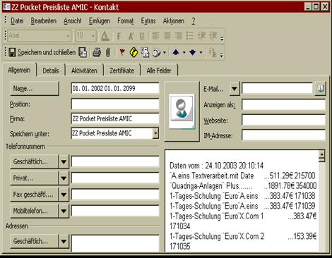
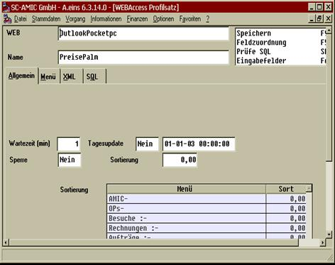
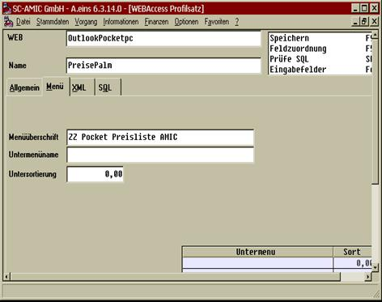
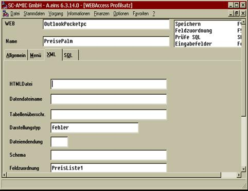
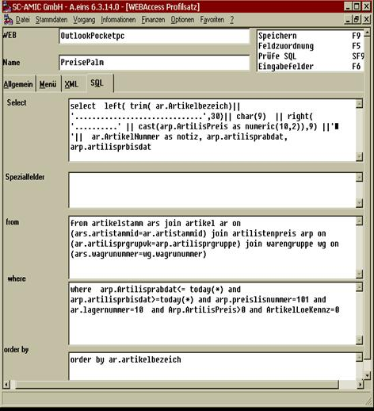
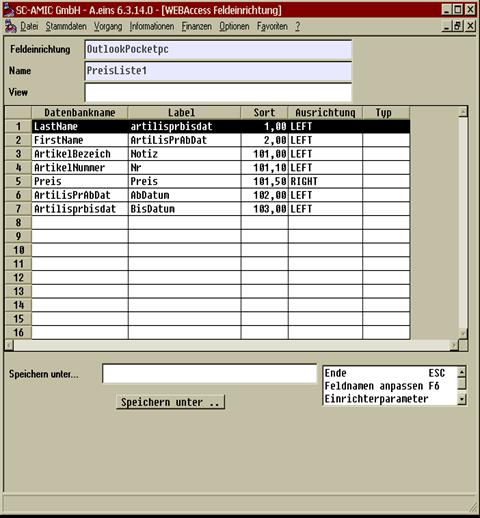

# Mehrere Datensätze in einem Kontakt

<!-- source: https://amic.de/hilfe/mehreredatenstzeineinemkontakt.htm -->

Sollen mehrere Datensätze in einem Kontakt abgelegt werden, wie es z.B. bei einer Preisliste der Fall ist, so muss dieses wie folgt angelegt werden :

Tabreiter 1 :

Die Wartezeit ist auf 1 zu stellen, und die Sperre auf Nein.

Tabreiter 2:

Die Menüüberschrift gibt den Outlook „Speichern unter“ Bereich an.

Im Tabreiter 3

wird die oben schon erwähnte Feldzuordnung angegeben, die dann per F5 aufgefüllt wird, um die Feldzuordnungen zu den einzelnen Kontaktfeldern herzustellen.

Im Tabreiter 4 :

Ist dann das komplette Sql Statement anzugeben, wobei der Notizbereich wieder als Feld Notiz mit einem Alias Namen versehen werden muss.

Unter der Feldzuordnung sind in diesem Beispiel die Felder von Datum und bis Datum Gültigkeit des Preises in das Feld Vorname (FirstName) und Nachname (LastName) eingetragen. Die Feldsortierungen über 100 spielen in diesem Bereich keine Rolle.

