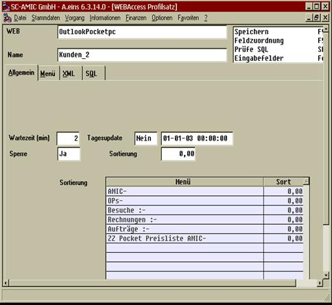
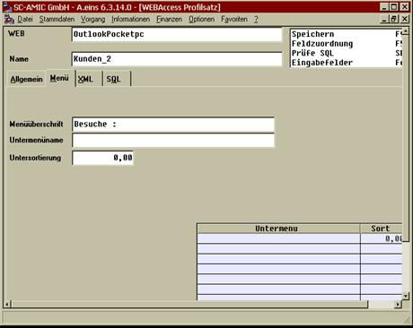
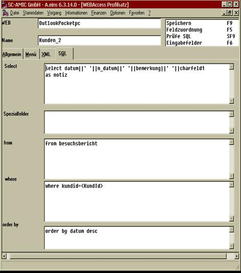
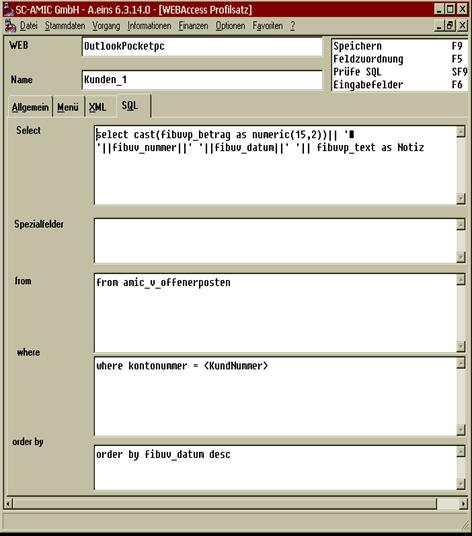
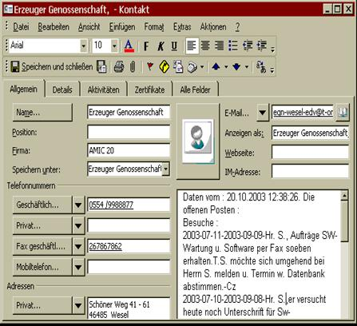

# Zusatzinformationen zu eine Kontaktkarte

<!-- source: https://amic.de/hilfe/zusatzinformationenzueinekonta.htm -->

Soll nun auf einem Kontaktkarte noch zusätzlich eine Information über die letzten Besuche, oder eine Information über die Rechnungen zu sehen sein, so kann dieses per Zusatzprofil eingerichtet werden.

Die Verbindung zwischen Hauptsatz und Anhang erfolg über den Profilnamen, der Hauptprofilname lautet in dem obigen Beispiel KUNDEN, zu Zusatzprofile sind gekennzeichnet durch KUNDEN_1 bis KUNDEN_4. Es gilt die Regel, dass der Hauptname von einem Unterstreichung Strich gefolgt werden muss, und danach eine Zahl angegeben werden muss. Die Zahl ist lückenlos durchzunummerieren.

Der erste Unterdatensatz sieht dann wie folgt aus :

Wichtig ist hierbei, dass die Wartezeit auf 2 gestellt wird, und dass die Sperre auf Ja steht.

Tabreiter 2 steuert die Überschrift zu diesem Unterbereich, Tabreiter 3 ist komplett freizulassen und Tabreiter 4 Steuert das SQL Statement.

Wichtig ist hierbei, das das .Ergebnisfeld IMMER Notiz heisst.

In der Where Bedingung ist nun die Verknüpfung zu dem Hauptdatensatz anzugeben, in diesem alle über die KundId, die in Spitz Klammern einzuschließen ist.

Im folgenden Beispiel wird über die Kundennummer der Offene Posten referenziert :

Das Ergebnis sieht dann wie folgt aus :

In dem Notizblock des Kontaktordners sind alle Daten hintereinander eingetragen.
