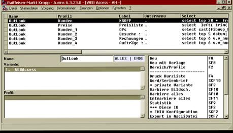
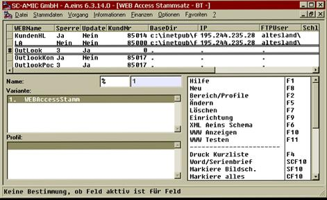
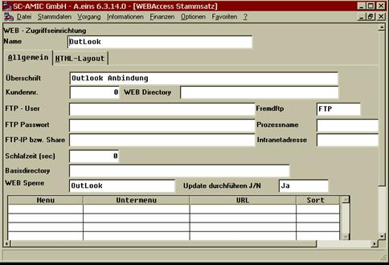
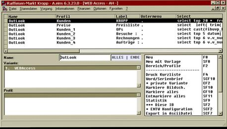

# Einrichtung Outlook generell

<!-- source: https://amic.de/hilfe/einrichtungoutlookgenerell.htm -->

Mit dem Direktsprung WWW können die notwendigen Einrichtungen des System vorgenommen werden.

Um sich die Arbeit zu erleichtern, kann mit dem Setup Programm die komplette Beispiel Einrichtung per SQL übernommen werden (mit dem OSQL Direktsprung die Datei \\aeins\\sql\\AoutlookKontakte.sql einpielen).

In der Basiseinrichtung wird den Kundenstamm einer bestimmten Vertretergruppe in das Outlook System übernommen. Zu den Stammdaten werden die Offenen Posten, die Besuchsberichte, die letzten 6Rechnungen und die letzten 3 Aufträge mit in den Notiz Bereich des Kontaktes übergeben. Im einzelnen sieht die Einrichtung wie folgt aus :

Im Direktsprung www ist ein Satz mit dem F8 (Neu) Knopf angelegt worden, der wie folgt eingerichtet ist:

Zu beachten ist hier lediglich, dass das Feld „WEB Sperre“ mit der Kennzeichnung 3 = Outlook versehen werden muss. Im Anschluss an die Anlage der Stammsatzes können die einzelnen Dateninterfaces mit der F9 Funktion (Einrichtung) eingerichtet werden.

Im folgenden Beispiel sind die Bereiche Kunden, Offene Posten, Besuche, Rechnungen, Aufträge und Preisliste eingerichtet.

