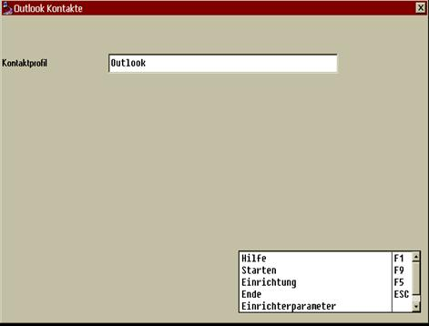

# Stamm- und Bewegungsdaten übergeben

<!-- source: https://amic.de/hilfe/stammundbewegungsdatenbergeben.htm -->

Um im Outlooksystem im Kontaktordner die einem zugeordneten Kunden / Lieferanten mit ihren Bewegungsdaten sehen zu können, müssen diese aus dem A.eins System in das Outlook System übergeben werden. Hierzu steht folgende Routine zur Verfügung:

Mit dem Direktsprung OUTLK kann über die Funktion "Outlook Kontakte" ein Export vorgenommen werden.

Nach F3 Auswahl des Profils kann der F9 Startknopf angewählt werden.

Es werden alle Daten mit ihren angehängten Bewegungsdaten eines Profils übertragen, wobei nur angefügt und überschrieben wird, aber nicht gelöscht, so dass durch Mehrfachanwahl dieses Moduls immer wieder Ergänzungen vorgenommen werden können.

Die Einspielroutine kann aber auch „von Hand“ gestartet werden, und zwar aus dem Bin Verzeichnis heraus mit dem Befehl :

Vbscript.exe qoutlookkontakte.vbs /dsn=&lt;odbc datasetname> /profil=&lt;profilname>

Wobei der Datasetname der ODBC Verbindung angegeben werden muss sowie der Name des im Bereich WWW angelegten Profils.
