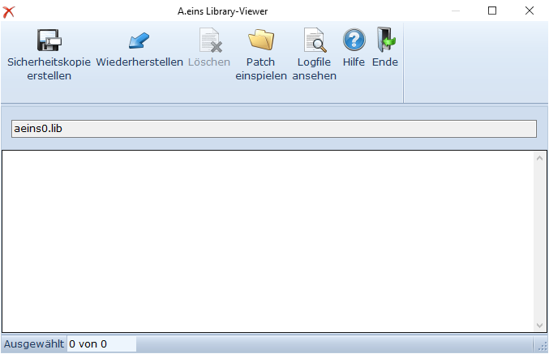
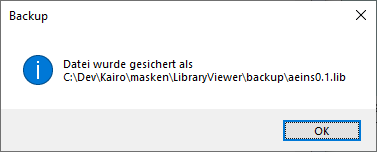
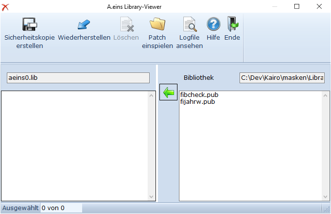

# Patch einspielen

<!-- source: https://amic.de/hilfe/_patcheinspielen.htm -->

Hauptmenü > Administration > Werkzeuge > Patch einspielen

oder Direktsprung **[PATCH]**

Wird diese Funktion aufgerufen, öffnet sich ein externes Programm (A.eins.Libraryviewer.exe), mit dessen Hilfe die von AMIC bereitgestellten Patche eingespielt werden können. Die Installation des Patches muss – wie vorher schon mit der repair.bat - pro A.eins-Installation und falls SQL-Skripte eingespielt werden müssen, pro Mandant ausgeführt werden.

| Funktion | |
| --- | --- |
| Sicherheitskopie erstellen | Die Patch-Bibliothek „aeins0.lib“ wird als Datensicherung in das Verzeichnis „.\\masken\\libraryviewer\\backup“ kopiert. Dabei wird eine Nummer hinter dem Dateinamen hochgezählt, damit ältere Sicherungen nicht überschrieben werden.   |
| Wiederherstellen | Wird diese Funktion ausgewählt, öffnet sich ein Dateiauswahldialog auf dem Verzeichnis „.\\masken\\libraryviewer\\backup“ und man kann eine der vorher gespeicherten Bibliotheken (s.o.) auswählen. Die in dieser Bibliothek enthaltenen Daten werden aufgelistet und man kann diese einzeln auswählen. Der Pfeil in der Mitte überträgt sie in die aktive Patch-Bibliothek.    Mit Escape verlässt man diesen Modus.  |
| Löschen | Einzelne Dateien können aus der Patch-Bibliothek gelöscht werden. Tritt hierbei ein Fehler auf, z.B. weil der Anwender keine Schreibrechte hat, dann werden diese in die Log-Datei unter „.\\masken\\libraryviewer\\log“ geschrieben.  |
| Patch einspielen | Man kann mit dieser Funktion die von AMIC bereitgestellte ZIP-Datei auswählen, oder einfach die Dateien aus dem Explorer mit Drag and Drop in das Anzeigefenster ziehen. Zip Dateien werden automatisch in das Unterverzeichnis LibraryViewer.Temp des A.eins-Temp-Ordners entpackt (Im Explorer %temp%\\A.eins\\LibraryViewer.Temp) . Daten mit der Endung „.pub“, „.jam“ und Dateien ohne Dateinamenserweiterung werden sofort in die Aeins0.Lib eingespielt. Dateien mit der Endung SQL werden in einem weiteren Fenster angezeigt und man kann dort auswählen, welche Skripte sofort ausgeführt werden sollen. Alle anderen Dateitypen werden ignoriert. Über die rechte Maustaste steht ein Kontext-Menü zur Verfügung. Mit der Funktion „Ansehen“ wird das markiert Skript angezeigt   Tritt beim Einspielen ein Fehler auf, z.B. weil der Anwender keine Schreibrechte hat, dann werden diese in die Log-Datei unter „.\\masken\\libraryviewer\\log“ geschrieben.  |
| Logfile ansehen | Es werden alle durchgeführten Aktionen in einer Logdatei mitgeschrieben. Diese Logdatei hat im Namen das Tagesdatum, so dass hier immer nur die aktuellen Aktionen des Tages angezeigt bekommt. Alle anderen Dateien findet man unter „.\\masken\\libraryviewer\\log“  |
| Hilfe | Diese Hilfe  |
| Ende | Beendet diese Funktion  |

Log-Dateien werden im Verzeichnis „.\\masken\\libraryviewer\\log“ hinterlegt. Log-Dateien werden vom Library-Viewer nicht gelöscht.
