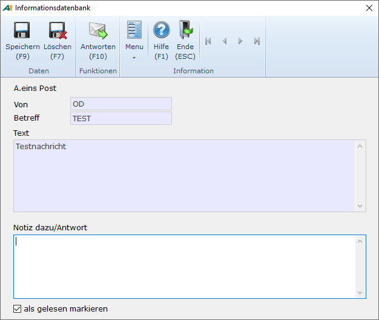

# Eingegangene Post Bearbeiten/Beantworten

<!-- source: https://amic.de/hilfe/eingegangenepostbearbeitenbean.htm -->

Hauptmenü > Büro und Internet \> Büroumgebung > A.eins Post

Direktsprung **[POST]**

Mit der Funktion „Bearbeiten/Antworten“ F5 können sie eingegangene Post bearbeiten,

Auf dieser Maske kann eine Notiz oder Antwort erfasst werden. Mit der Funktion „***Antworten***“ **F10** wird diese Antwort wieder demjenigen zugeordnet, der die Nachricht erstellt hatte, so dass dieser dann die Notiz dazu einsehen kann.

Der Haken bei „als gelesen markieren“ steht beim Betreten einer Nachricht immer auf aktiv. Beim Verlassen der Nachricht wird gefragt, ob die Daten gespeichert werden sollen. Wenn diese Frage mit **nein** beantwortet wird, dann wird weder der eventuell geänderte Notiztext noch das Kennzeichen gespeichert.

Durch Deaktivieren des Hakens kann der Lesestatus wieder zurückgesetzt werden.
