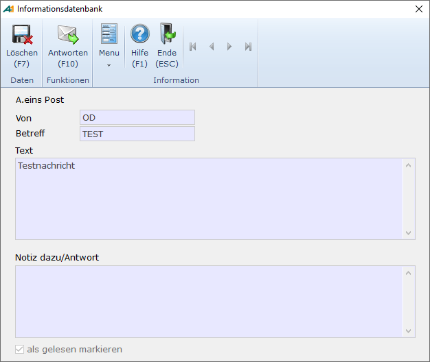

# Eingegangene Post löschen

<!-- source: https://amic.de/hilfe/eingegangenepostlschen.htm -->

Hauptmenü > Büro und Internet \> Büroumgebung > A.eins Post

Direktsprung **[POST]**

Nach Aufruf der Funktion „***Löschen***“ **F7** erscheint folgende Maske:

Beim „***Löschen***“ **F7** wird der Datensatz physikalisch gelöscht und kann nicht wieder hergestellt werden.
