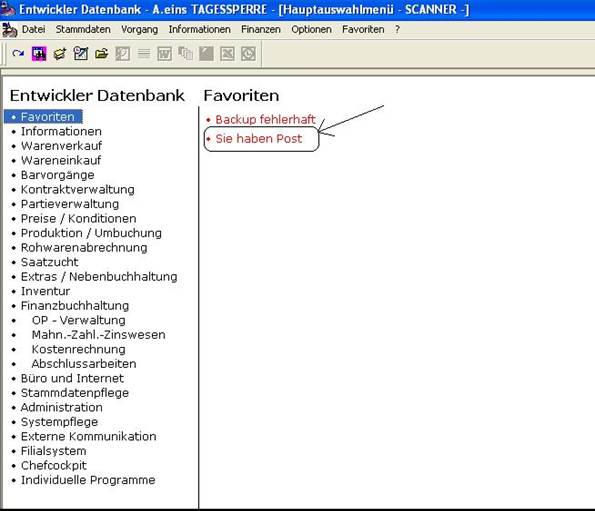

# Post

<!-- source: https://amic.de/hilfe/post.htm -->

Hauptmenü > Büro und Internet \> Büroumgebung > A.eins Post

Direktsprung **[POST]**

In A.eins existiert die Möglichkeit einzelnen oder allen Benutzern eine Mitteilung zu senden. Sollte der Empfänger der Meldung im System angemeldet sein, so erhält er eine Mitteilung, dass die Meldung eingegangen ist. Ist er nicht im System angemeldet, wird ein für ihn sichtbarer Eintrag in die Favoritenliste gesetzt. Dieser Eintrag wird beim nächsten Anmelden in A.eins dargestellt.

Siehe auch:

- [Neue Post erstellen](./neue_post_erstellen.md)
- [Eingegangene Post Bearbeiten/Beantworten](./eingegangene_post_bearbeiten_beantworten.md)
- [Eingegangene Post löschen](./eingegangene_post_loeschen.md)
