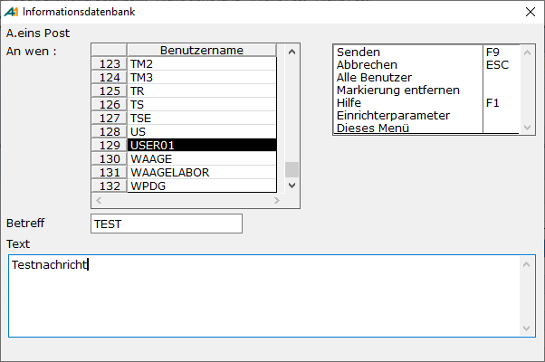

# Neue Post erstellen

<!-- source: https://amic.de/hilfe/neueposterstellen.htm -->

Hauptmenü > Büro und Internet \> Büroumgebung > A.eins Post

Direktsprung **[POST]**

In der Anwendung „A,eins Post“ erscheint nach Aufruf der Funktion „***Neu***“ **F8** folgender Bildschirm:

Mit der Funktion „***Senden***“ **F9** erhalten alle ausgewählten Anwender die unter Text erfasste Nachricht. Sollte der ausgewählte Anwender im System angemeldet sein, so erhält dieser eine Mitteilung, dass eine Nachricht eingegangen ist. Ist der Benutzer nicht im System angemeldet, wird ein für den Anwender sichtbaren Eintrag in die Favoritenliste gesetzt. Dieser Eintrag wird beim nächsten Anmelden in A.eins dargestellt.
