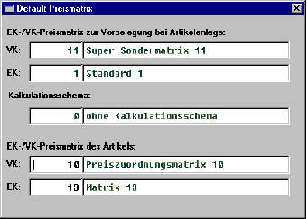

# Artikel-Sekundärmaske

<!-- source: https://amic.de/hilfe/artikelsekundrmaske.htm -->

Das Kalkulationsschema, die Default-Preismatrix-Einträge des Artikelstamms sowie die im Artikel hinterlegten Preismatrix-Einträge sind nun auch vom Artikelpfleger erreichbar. Hierzu gibt es eine neue Artikel-Sekundärmaske, die über den OB-Eintrag „Preismat./Kalk.Schema“ aufgerufen wird. Im Falle der Neuanlage eines Artikelstammes können hier auch die stammspezifischen Felder gepflegt werden.

