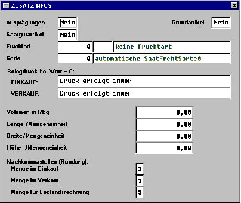

# Artikelstamm-Sekundärmaske

<!-- source: https://amic.de/hilfe/artikelstammsekundrmaske.htm -->

In der zum Artikelstamm-Pfleger gehörigen Sekundär-Maske „Zusatzinfos“ wird das für das ZG-Preiskalkulationsmodul benötigte Artikelstammfeld

ArtiStamGrundArt 

Ja-/Nein-Feld zur Bestimmung von Grundartikeln, deren Preise nicht dezentral gepflegt werden können.

 aufgenommen. 

