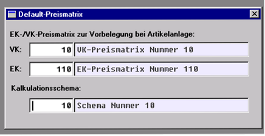

# Artikelstamm-Sekundärmaske „Default-Preismatrix“

<!-- source: https://amic.de/hilfe/artikelstammsekundrmaskedefaul.htm -->

Im Artikelstamm-Pfleger gibt es eine neue Sekundär-Maske, zum Pflegen folgender Artikelstammfelder:

PreisMatNummerVK 

Vorbelegung für VK-Preismatrix-Feld im Artikel bei Artikelneuanlage zum Artikel (ist somit jetzt pflegbar!).

PreisMatNummerEK 

Vorbelegung für EK-Preismatrix-Feld im Artikel bei Artikelneuanlage zum Artikel (ist somit jetzt pflegbar!).

Diese Felder geben es bereits im Artikelstamm, wurden aber bisher nicht offengelegt. Bei manueller Neuanlage eines Artikels einem Artikelstamm, werden die Artikelfelder PreisMatNummerVK und PreisMatNummerEK mit den entsprechenden Artikelstammfeldern vorbelegt.

PrKalkSchema

Neues Artikelstammfeld zum Einstellen des im Kalkulationsmodul für Artikel dieses Artikelstamms gültigen Schemas.

