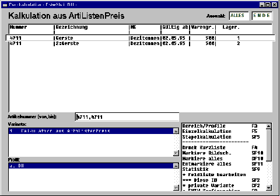

# Auswahllistenvarianten (Preisnachkalkulation)

<!-- source: https://amic.de/hilfe/auswahllistenvariantenpreisnac.htm -->

Die Anwendung ‚Standard-Preiskalkulation‘ verfügt über zwei Auswahlvarianten:

A) Per Ref.Liste

C) Alle Artikel

Es ist steht jedoch nur diejenige Variante zur Verfügung, die sich aus der Einstellung des SPA’s ‚Preiskalkulation: zugelassene Artikel‘ ergibt:

1: nur Artikel aus Referenzliste : Variante A

0: alle Artikel : Variante B

In beiden Varianten können Artikel mit folgender Bereichsauswahl selektiert werden:

Artikelnummer:

Auswahl von Unter- und Obergrenze der zu berücksichtigenden Artikelnummern.

ACHTUNG: Die Artikelnummer ist alphanumerisch, d.h. die Auswahl ist lexikographisch!

Artikel gültig ab:

Es werden nur Artikel in die Auswahlliste übernommen, deren Gültigkeits-AbDatum im angegebenen Bereich liegt!

Warengruppe:

Es werden nur Artikel in die Auswahlliste übernommen, deren Warengruppe im angegebenen Bereich liegt!

Lagernummer:

Es werden nur Artikel in die Auswahlliste übernommen, deren Lagernummer im angegebenen Bereich liegt!

Zusätzliche Einschränkungen:

Es werden in der Variante A nur Artikel in die Auswahlliste übernommen, deren VK-Listenpreisgruppe sich in der Referenzliste befinden.

Es werden nur Artikel in die Auswahlliste übernommen, die über eine Kalkulationsschemanummer größer 0 verfügen.

Es werden nur Artikel in die Auswahlliste übernommen, die keine Grundartikel sind.

Es werden nur Artikel in die Auswahlliste übernommen, deren Kalkulationsschema als Kalkulationsgrundlage die Relation KalkListenpreis verwendet.

Die Auswahlliste zeigt für jeden Artikel folgende Werte:

Befinden sich Artikel in der Auswahlliste, so können diese bzw. die hierfür markierten Artikel kalkuliert werden. Hierfür stehen zwei Funktionen zur Verfügung:

Einzelkalkulation F5

Diese Funktion ist nur dann verfügbar, wenn der SPA

‚ Preiskalk.: manuelle Kalkulation erlaubt‘

mit dem Wert ‚Ja‘ eingestellt ist.

Stapelkalkulation SF5

Diese Funktion ist nur dann verfügbar, wenn der SPA

‚ Preiskalk.: Stapelkalkulation erlaubt ‘

mit dem Wert ‚Ja‘ eingestellt ist.

Einzelkalkulation

Die Funktion entspricht der unter 1.7.2 beschriebenen Funktion, mit der Ausnahme, dass die Preise der Spalte ‚Originalpreise‘ hier immer den unter 1.8 beschriebenen aus ArtiListenPreis entsprechen.
