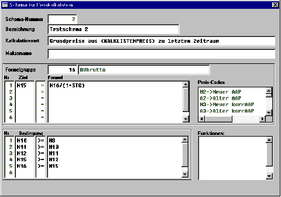

# Beispiel für Gruppe 16 (Schema)

<!-- source: https://amic.de/hilfe/beispielfrgruppe16schema.htm -->

Es können hier Gruppen für jeden in der Relation PREISLISTE enthaltenen Preisbezeichnungseintrag ohne Preiskorrektursperrkennzeichen und mit einer Kalkulationssortierung > 0.00 angelegt werden, im Kalkulationsmodul werden jedoch nur diejenigen berücksichtigt, deren Preise auch manuell änderbar und im Preismatrixaufbau vorhanden sind.

Die Bedingungen gelten global für das gesamte Schema, also gruppenunabhängig. Sie werden erst angewandt, bevor die Preise nach der Kalkulation gespeichert werden.
