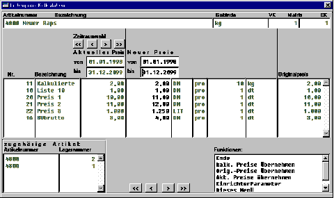

# Einzelkalkulation

<!-- source: https://amic.de/hilfe/einzelkalkulation.htm -->

Die Einzelkalkulation ist eine Kalkulationsform mit manuellen Eingreifmöglichkeiten.

Die Kalkulationsmaske hat folgendes Aussehen:

Siehe auch:

- [Info-Bereiche](./info_bereiche.md)
- [Haupt-Bereich](./haupt_bereich/index.md)
- [Kalkulation](./kalkulation.md)
- [Endbehandlung](./endbehandlung.md)
