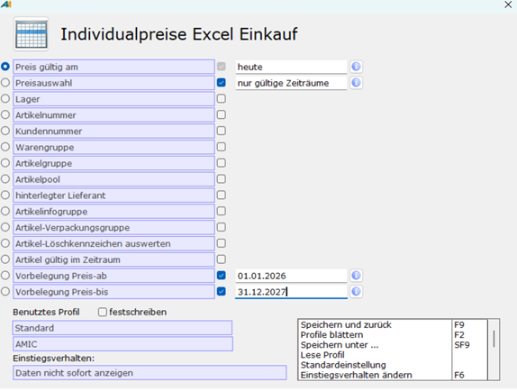

# Exportprofil einrichten

<!-- source: https://amic.de/hilfe/_ExportprofilEinrichten.htm -->

Hauptmenü > Preise / Konditionen > Preiskalkulation tabellarisch > Individualpreiskalkulation Excel

Direktsprung **[PKXI]**

Um den Export der Individualpreise durchzuführen, muss zuerst das Exportprofil bestimmt werden. Dafür den nächsten Schritten folgen:

1. In der Variante **Individualpreise Excel Einkauf** bzw. **Verkauf** über das **Fernglas-Symbol** im oberen Bereich oder mit **F2** den Dialog **Individualpreise Excel Einkauf** bzw. **Verkauf** aufrufen, um die Individualpreise zu filtern und eine Vorbelegung durchzuführen.

2. Für das Kriterium **Preis gültig am** kann ein Datum über den interaktiven Kalender, der sich mit Doppelklick im Feld öffnet, ausgewählt werden. Alternativ kann ein Datum, oder der Wert „heute“ eingetragen werden.

3. Mit dem Kriterium **Preisauswahl** kann festgelegt werden, ob ausschließlich zu dem zuvor definierten Zeitpunkt gültige, alle, oder gültige und zukünftig gültige Individualpreise angezeigt werden.

4. Optional können weitere Filterkriterien für die Individualpreise ausgewählt werden, indem vor dem jeweiligen Kriterium das Optionsfeld aktiviert und ein Wert zum Filtern eintragen wird. Mit dem Druck von **F3** in einem Feld, kann eine Auswahl aller möglichen Ausprägungen angezeigt werden.

5. Eine mögliche Vorbelegung für den Gültigkeitszeitraum der Individualpreise kann über die Kriterien **Vorbelegung Preis-ab** und **Vorbelegung Preis-bis** vorgenommen werden. Für diese Felder kann über Doppelklick im Feld eine Auswahl über den Kalender getroffen oder direkt ein Datum eingetragen werden.

6. Die Einstellungen können durch den Druck von **F9** oder die Wahl von **Speichern und zurück** in der Optionsbox am rechten unteren Rand des Dialogs übernommen werden. Die Auswahlliste wird aktualisiert und nach den ausgewählten Kriterien gefiltert.

7. Die Auswahl sollte noch einmal überprüft werden. Die Excel-Datei wird auf dieser Basis im nächsten Schritt generiert.
