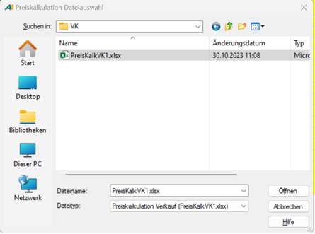

# Neue Preis-Exceldatei in A.eins importieren F9

<!-- source: https://amic.de/hilfe/_PreiskalkulationExcelPreiskalkulation.htm -->

Hauptmenü > Preise / Konditionen > Preiskalkulation tabellarisch > Preiskalkulation Excel > Funktion ***Preiskalkulation Einkauf/Verkauf***

Direktsprung **[PKX]**. > Funktion ***Preiskalkulation Einkauf/Verkauf***

Um die neue Preis-Exceldatei zu importieren, wie folgt vorgehen:

1. Prüfen Sie die Exceldatei mit den neuen Preisen oder leiten Sie die Kalkulation zur Freigabe weiter.

2. Klicken Sie auf ***Preiskalkulation Verkauf bzw. Einkauf*** oder drücken Sie **F9**.

3. Die Auswahlliste ***Preiskalkulation*** ***Dateiauswahl*** öffnet sich.

4. Wählen Sie die Datei aus, die importiert werden soll.

Die neuen Preise sind in den Artikel und Ihren Preislisten hinterlegt.

Wenn die Übermittelung einen Fehler ergab, wird eine Fehlermeldung aufgerufen.

#### Tipp!

**Überprüfung der Preise prüfen!**

Sie können die neue Preise über den Bereich Profile prüfen:

- Setzen Sie unter ***Preise gültig am*** ein Datum, das **\>=** dem Datum Vorbelegung Preis ab aus ist.

Die neuen Preise werden nun in der Auswahlliste bereits angezeigt und können abgeglichen werden.
