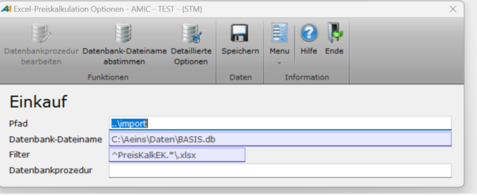

# Preisdatenexport einrichten F10

<!-- source: https://amic.de/hilfe/_PreiskalkulationExcelOptionen.htm -->

Hauptmenü > Preise / Konditionen > Preiskalkulation tabellarisch > Preiskalkulation Excel > Funktion ***Optionen Einkauf/Verkauf***

Direktsprung **[PKX]**. > Funktion ***Optionen Einkauf/Verkauf***

Um die Einrichtung des Preiskalkulationsexcels zu starten, wie folgt vorgehen:

1. Wählen Sie eine Variante der Liste ***Preiskalkulation*** (VK für Verkaufspreise oder EK für Einkaufspreise).

2. Setzen Sie genaue Filter, um die zu kalkulierenden Preisdaten zu exportieren.

3. Klicken Sie auf ***Optionen Verkauf*** bzw. ***Optionen Einkauf*** oder drücken Sie ***F10***.

4. Geben Sie im ***Pfad*** an, wo die zu exportierenden Daten als Excel Arbeitsblatt abgespeichert werden sollen (z. B.:„..\\import\\vk“).

#### Hinweis!

Die Felder ***Filter*** und ***Datenbank-Dateiname*** sind bereits vorbelegt durch Ihre gesetzten Filter sowie die in Ihrem A.eins hinterlegte Datenbank.

5. Drücken Sie **F3** im Feld ***Datenbandprozedur***, um die Standardprozedur ***amic_excel_Preisimport_VK*** bzw. ***amic_excel_Preisimport_EK*** einzutragen.

***Optional***: **Private Datenbankprozedur anlegen**

Sie können Private Prozeduren anlegen, die sowohl **fa_id** (Formulararchiv ID) als auch **fa_mndnr** (Formulararchiv Mandantennummer) übergeben können.

#### Hinweis!

Legen Sie private Prozeduren immer mit einem vorangestellten **P** an, sodass diese nur für Sie als private Prozedur in A.eins vorhanden sind.

Um eine private Prozedur anzulegen, wie folgt vorgehen:

1. Tragen Sie im Feld ***Datenbankprozedur*** einen Namen beginnend mit **P_** für die neue Prozedur ein.

Die private Datenbankprozedur wird nun anhand der Standardprozedur ***amic_excel_Preisimport_VK*** bzw. ***amic_excel_Preisimport_EK*** mit notwendigen Parametern angelegt.
