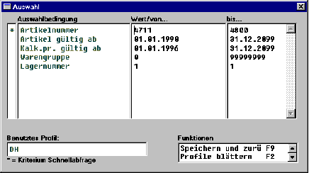
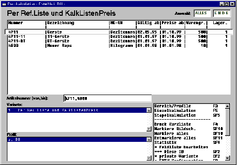

# Alle Artikel mit KalkListenPreis

<!-- source: https://amic.de/hilfe/alleartikelmitkalklistenpreis.htm -->

Hier können Artikel mit folgender Bereichsauswahl selektiert werden:

Artikelnummer:

Auswahl von Unter- und Obergrenze der zu berücksichtigenden Artikelnummern.

ACHTUNG: Die Artikelnummer ist alphanumerisch, d.h. die Auswahl ist lexikographisch!

Artikel gültig ab:

Es werden nur Artikel in die Auswahlliste übernommen, deren Gültigkeits-AbDatum im angegebenen Bereich liegt!

Kalk.Pr. gültig ab:

Es werden nur Artikel in die Auswahlliste übernommen, zu deren VK-Listenpreisgruppe zur eigenen Filialnummer Preise in der Relation KalkListenPreis vorhanden sind, deren AbDatum im angegebenen Bereich liegen!

Warengruppe:

Es werden nur Artikel in die Auswahlliste übernommen, deren Warengruppe im angegebenen Bereich liegt!

Lagernummer:

Es werden nur Artikel in die Auswahlliste übernommen, deren Lagernummer im angegebenen Bereich liegt!

Zusätzliche Einschränkungen:

Es werden nur Artikel in die Auswahlliste übernommen, zu deren VK-Listenpreisgruppe zur eigenen Filialnummer in der Relation KalkListenPreis mindestens ein Preis vorhanden ist.

Es werden nur Artikel in die Auswahlliste übernommen, die über eine Kalkulationsschemanummer größer 0 verfügen.

Es werden nur Artikel in die Auswahlliste übernommen, die keine Grundartikel sind.

Es werden nur Artikel in die Auswahlliste übernommen, deren Kalkulationsschema als Kalkulationsgrundlage die Relation KalkListenpreis verwendet.

Die Auswahlliste zeigt für jeden Artikel folgende Werte:

 

Befinden sich Artikel in der Auswahlliste, so können diese bzw. die hierfür markierten Artikel kalkuliert werden. Hierfür stehen zwei Funktionen zur Verfügung:

Einzelkalkulation F5

Diese Funktion ist nur dann verfügbar, wenn der SPA

‚ Preiskalk.: manuelle Kalkulation erlaubt‘

mit dem Wert ‚Ja‘ eingestellt ist.

Stapelkalkulation SF5

Diese Funktion ist nur dann verfügbar, wenn der SPA

‚ Preiskalk.: Stapelkalkulation erlaubt ‘

mit dem Wert ‚Ja‘ eingestellt ist.
