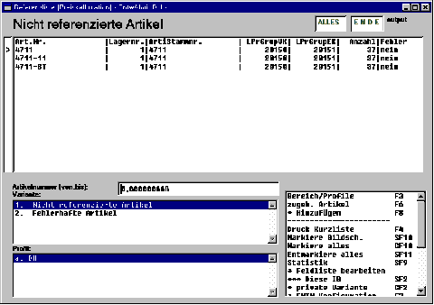

# Nicht referenzierte Artikel

<!-- source: https://amic.de/hilfe/nichtreferenzierteartikel.htm -->

Hier wird nach Angabe des Auswahlbereiches

Artikelnummer von... bis...

Lagernummer von... bis...

Eine Liste Aufgebaut, in der alle Artikel des gewählten Bereiches gelistet werden, die eine ListenpreisgruppeVK > 0, ein Kalkulationsschema > 0 haben, keine Grundartikel sind und deren ListenpreisgruppeVK sich nicht in der Referenzliste befinden.

Zu jedem Artikel wird angezeigt:

Die Artikelnummer

Die Lagernummer

Die zugehörige Artikelstammnummer

Die Listenpreisgruppennummer VK

Die Listenpreisgruppennummer EK

Die Anzahl der Artikel mit derselben VK-Listenpreisgruppennummer, diese umfasst auch die korrespondierenden Artikel außerhalb des Selektionsbereiches 

Einen Hinweis auf evtl. bezgl. der Preiskalkulation fehlerhaft eingerichtete Artikel (Fehler: ja/nein)

 Der Fehlerhinweis ist genau dann ‚ja’, wenn einer der folgenden Fälle besteht:

es gibt Artikel, die zwar die gleiche VK-Listenpreisgruppennummer aber eine andere EK-Listenpreisgruppennummer als der gelistete Artikel haben und die SPA-Einstellung für ‚ Preiskalk.: EK-Listenpreisgruppen‘ ist ‚ Lesen, Kalkul., KEINE SPEICHERUNG‘ oder ‚ volle Berücksichtigung‘.

es gibt Artikel, die zwar die gleiche EK-Listenpreisgruppennummer aber eine andere VK-Listenpreisgruppennummer als der gelistete Artikel haben, es sei denn, die EK- Listenpreisgruppennummer ist 0 oder die SPA-Einstellung für ‚‚ Preiskalk.: EK-Listenpreisgruppen‘ ist ‚keine Berücksichtigung‘

es gibt Artikel, die zwar die gleiche VK-Listenpreisgruppennummer aber ein anderes Kalkulationsschema als der gelistete Artikel haben.

Derartige Einrichtungen würden insbesondere bei der Preiskalkulation zu zufälligen Ergebnissen führen, da ja ein und dieselben Preise je nach Artikelauswahl entweder aus anderen EK-Preisen oder mit anderen Formeln berechnet würden.

In dieser Auswahllistenvariante gibt es, wenn Einträge gelistet sind, zwei wesentliche Funktionen:

zugeh. Artikel

\* Hinzufügen

Die zweite Funktion steht nur Bedienern mit Administrator-Rechten zur Verfügung.

Siehe auch:

- [Zugeh. Artikel](./zugeh_artikel.md)
- [Hinzufügen (Preiskalkulation)](./hinzufuegen_preiskalkulation.md)
