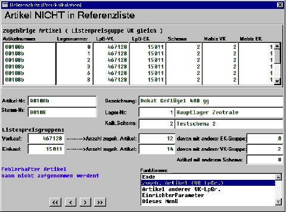

# Zugeh. Artikel

<!-- source: https://amic.de/hilfe/zugehartikel.htm -->

Die hier genutzte Maske ist dieselbe, wie in den Funktion ‚Hinzufügen‘ dieser Variante, der Funktion ‚zugeh. Artikel‘ der Variante ‚Fehlerhafte Artikel‘ und der Funktionen ‚ zugeh. Artikel‘ und ‚Entfernen‘ der Anwendung

 ‚Ref. entfernen (Preiskalk.) PKRFL‘.

Unterscheidungen gibt es hinsichtlich der dort vorhandenen Funktionen.

Der obere Teil der Maske bleibt nach Einstieg bzw. Blättern zunächst leer.

Darunter sind etwas genauere Angaben zum Artikel angegeben:

Insbesondere wird zu den beiden Listenpreisgruppen die Anzahl der Artikel mit jeweils gleicher Gruppe, sowie SPA-abhängig der darin enthaltene Anteil von Artikeln mit Unterscheidung bei der jeweils anderen Gruppe angegeben. Auch die Anzahl der Artikel mit gleicher VK-Listenpreisgruppe aber anderem Preiskalkulationsschema ist hier zu sehen.

Je nach Inhalt dieser Felder enthält die Optionbox der Maske folgende Einträge:

\* Hinzufügen zur Referenzliste

Mit dieser Funktion wird die VK-Listenpreisgruppe des Artikels in die Referenzliste eingetragen. Diese Funktion ist aber nur in der Funktion ‚Hinzufügen‘ der Anwendungsvariante ‚ Nicht referenzierte Artikel‘ vorhanden, wenn der Artikel nicht fehlerhaft bzgl. der Preiskalkulation ist.

Ende

Verlassen der Maske

\* Entfernen aus Referenzliste

 Mit dieser Funktion wird die VK-Listenpreisgruppe des Artikels aus der Referenzliste entfernt. Diese Funktion ist aber nur in der Funktion ‚Entfernen‘ der Anwendung ‚ Ref. entfernen (Preiskalk.) PKRFL ‘ vorhanden.

zugeh. Artikel (VK-LpGr.)

Diese Funktion ist immer vorhanden und bewirkt das Füllen des oberen Anzeige-Arrays der Maske mit den Daten aller Artikel mit der VK-Listenpreisgruppe.

Artikel anderer VK-LpGr.

Diese Funktion ist immer dann vorhanden, wenn es Artikel zur EK-Listenpreisgruppe mit abweichender VK-Listenpreisgruppe gibt und die SPA-Einstellung für ‚ Preiskalk.: EK-Listenpreisgruppen‘ nicht ‚ keine Berücksichtigung‘ ist. Sie bewirkt das Füllen des oberen Anzeige-Arrays der Maske mit den Daten den betroffenen Artikel.

Artikel anderer EK-LpGr.

Diese Funktion ist immer dann vorhanden, wenn es Artikel zur VK-Listenpreisgruppe mit abweichender EK-Listenpreisgruppe gibt und die SPA-Einstellung für ‚ Preiskalk.: EK-Listenpreisgruppen‘ nicht ‚ keine Berücksichtigung‘ ist. Sie bewirkt das Füllen des oberen Anzeige-Arrays der Maske mit den Daten den betroffenen Artikel.

Artikel anderer Schemanr..

Diese Funktion ist immer dann vorhanden, wenn es Artikel zur VK-Listenpreisgruppe mit abweichendem Preiskalkulationsschema gibt und bewirkt das Füllen des oberen Anzeige-Arrays der Maske mit den Daten den betroffenen Artikel.

Artikel anderer VK-PrMat.

Diese Funktion ist immer dann vorhanden, wenn es Artikel zur VK-Listenpreisgruppe mit abweichender VK-Preismatrixnummer gibt und bewirkt das Füllen des oberen Anzeige-Arrays der Maske mit den Daten den betroffenen Artikel.

Artikel anderer EK-PrMat.

Diese Funktion ist immer dann vorhanden, wenn es Artikel zur VK-Listenpreisgruppe mit abweichender EK-Preismatrixnummer gibt und bewirkt das Füllen des oberen Anzeige-Arrays der Maske mit den Daten den betroffenen Artikel.

#### ACHTUNG:

*Unterschiedliche Preismatrixnummern bei gleicher Listenpreisgruppe ist nicht unbedingt ein Fehler, sondern kann gewollt sein. So könnte eine Preismatrix z.B. die Preislisten P1 und P2, eine andere aber P1 und P3 enthalten. Die beiden zugehörigen Artikelgruppen „sehen“ ja nur die Preise der gleichen Listenpreisgruppe „ihrer“ jeweiligen Preismatrix. Trotzdem stehen alle 3 Preise in der Preisrelation und können folglich auch „auf einmal“ kalkuliert werden, wenn das Kalkulationsschema das hergibt.*

