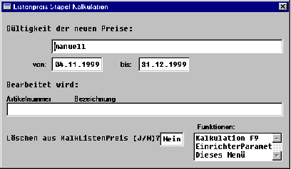

# Stapelkalkulation ausführen

<!-- source: https://amic.de/hilfe/stapelkalkulationausfhren.htm -->

Die Stapelkalkulation ist eine Kalkulationsform ohne manuelle Eingreifmöglichkeiten.

Die aufgerufene Maske hat folgendes Aussehen:

In Auswahllisten-Varianten mit Originalpreisen aus Kalklistenpreis wird zunächst bestimmt, ob die Ziel-Zeiträume der neuen Preise aus Kalklistenpreis oder per Datumseingabe manuell bestimmt wird.

In Auswahllisten-Varianten mit Originalpreisen aus ArtiListenPreis ist lediglich die Zeitraumbestimmung per Datumseingabe möglich.

Bei auf KalkListenPreis basierenden Varianten kann SPA-abhängig bestimmt werden, ob die korrespondierenden Daten aus KalkListenpreis gelöscht werden sollen. Diese Eingabemöglichkeit besteht nur dann, wenn der SPA ‚Kalkpr.Übern.: KalkListenPreis löschen‘ mit dem Wert ‚mit Abfrage‘ eingestellt ist.

Mit dem der Funktion ‚Kalkulation‘ wird die Kalkulation gestartet. Die Artikelnummern und Bezeichnungen werden während der Kalkulation auf der Maske angezeigt. Fehlermeldungen und Hinweise werden ins Fehlerprotokoll (FEHLP) geschrieben.

Die Kalkulation erfolgt entsprechend der Einzelkalkulation, übernommen werden immer die kalkulierten Preise.
