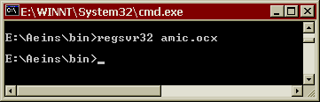
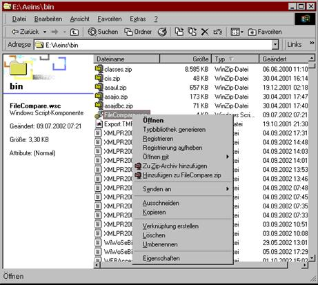

# Vorraussetzungen zum Prozessaufruf

<!-- source: https://amic.de/hilfe/vorraussetzungenzumprozessaufr.htm -->

Das Prozesskontrollsystem arbeitet nur im Aeins Umfeld, und es läuft nur auf einem Windows NT Rechner mit dem Betriebssystem 4.0 (SP6a) plus dem Windows Scripting Host 5.6 oder einem Windows 2000 oder Windows XP Rechner.

Zusätzlich zu dem Aeins System müssen noch zwei selbstregistrierende Objekte im System eingetragen werden, die wie folgt aktiviert werden:

Das \\aeins\\bin\\amic.ocx Objekt muss mit dem Kommando  
regsvr32 amic.ocx  
im \\aeins\\bin Verzeichniss in die Registrierdatenbank eingefügt werden  
    

Weiterhin muss die Datei FileCompare.wsc aus dem Bin Verzeichnis mit dem Kontextmenü des Explorers (Rechte Maustaste auf dieser Datei) registriert werden.  
  
    

Jetzt kann aus der Kommandobox im Windows Verzeichnis herraus der Prozessüberwachungsmonitor gestartet werden und zwar mit dem Befehl  
webaccess.wsf /process=&lt;prozessname> /idleloops=&lt;wartezyklen> /wait=&lt;anfangswartesekunden> /forever=&lt;0&#124;1> /sleeptime=&lt;schlaf_sekunden>  
**ACHTUNG:** die Leerzeichen zwischen den Parametern sind zwingend vorgeschrieben!
