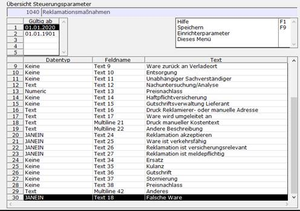
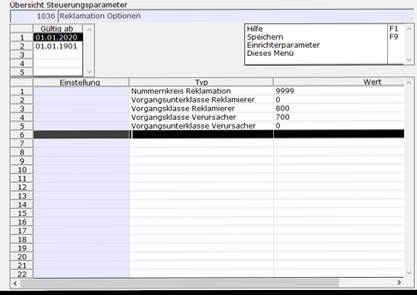

# Schritt 1: Einrichtung der Steuerparameter

<!-- source: https://amic.de/hilfe/schritt1einrichtungdersteuerpa.htm -->

1.1: Lizenz Steuerparameter

Um das Modul Reklamation zu aktivieren, ist eine Lizenz erforderlich. (Steuerparameter 1066)

1.2: Reklamationsmaßnahmen Steuerparameter

Um die Maßnahmen (und den dazugehörigen Report) anzupassen, navigiert man mit dem Direktsprung [SPA] in die Steuerparameter. Hier sucht man den [Steuerparameter 1040](../../../firmenstamm/steuerparameter/allgemeine_programmsteuerung/reklamationsmassnahme_spa_1040.md). Diese Felder können beliebig angepasst werden. Für das aktuelle Beispiel wird ein Textfeld hinzugefügt, welches anzeigt, ob der Kunde eine falsche Ware erhalten hat.

Achtung, eine Änderung der Bezeichner der Felder für Maßnahmen ändert nicht die Hinterlegung der Daten in der Datenbank.

Wenn Sie ein Feld anders bezeichnen, bleiben die Inhalte von der vorherigen Bezeichnung in der Datenbank an gleicher Stelle erhalten.

Eine Umstellung von Feld 1 auf Feld 2 muss auch in der Datenbank über SQL nachgezogen werden!

1.3: Reklamation Optionen Steuerparameter

Im [Steuerparameter 1036](../../../firmenstamm/steuerparameter/optionen_global/allgemeiner_steuerparameter_fuer_die_reklamation_spa_1036.md) werden die Optionen der Reklamation fest gelegt. Hier wird der Nummernkreis für die Reklamation festgelegt. Auch die Reporte des Reklamationsmodul können hier angepasst werden, indem man eigene Reporte in die Anwendungsreporte 1-5 einträgt. Für die Erstellung der Vorgänge können hier ebenfalls Einstellungen getroffen werden:

- Priorität 1 - Makro: Für die Nutzung eines Makros muss ein Makro erstellt werden, welches den kompletten Erstellungsprozess eines Vorgangs abbildet und am Ende die V_id (Vorgangs ID) in den Reklamationsstamm einträgt.
- Priorität 2 - SQL-Prozedur: Wenn kein Makro eingerichtet ist, kann eine SQL-Prozedur, Sachverhalte vor der Erstellung eines Vorgangs prüfen und ggf. in den Erstellungsprozess eingreifen.
- Priorität 3 - Vorgangs(unter)klassen: Nach der SQL-Prozedur wird der Vorgang, je nach Einstellung der Vorgangs(unter)klasse, vom Standard erstellt.

Für dieses Beispiel wird die Standardeinstellungen des Reports beibehalten. Als Nummernkreis wird der Standardnummernkreis der Reklamation verwendet:

Zum Erzeugen der Vorgänge werden die Standardvorgangsklassen verwendet, welche auf der Maske eingetragen werden. Hier kann die Vorbelegung eingestellt werden (700 Rechnung für den Verursacher und 800 Gutschrift für den Reklamierer).

