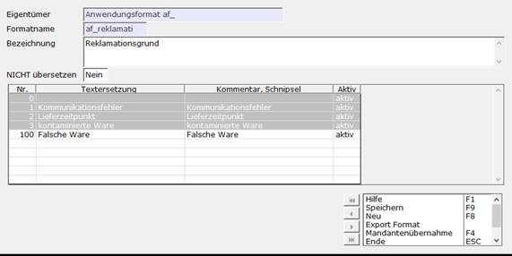
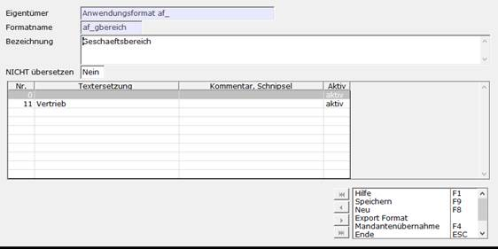

# Schritt 2: Report Einrichtung

<!-- source: https://amic.de/hilfe/schritt2reporteinrichtung.htm -->

2.1: Anwendungsformat Reklamationsgründe

Mit dem Direktsprung [FORMA] navigiert man in die Formatliste (Variante 2: [Anwendungsformate](../../../firmenstamm/formate.md#Anwendungsformate)). Hier sucht man nach „af_reklamati“ und bearbeitet den Datensatz. Die Nummern 0-99 sind gesperrt, die Erstellung eigener Reklamationsgründe erfolgt also ab 100.

2.2: Anwendungsformat Geschäftsformate

In den [Anwendungsformate](../../../firmenstamm/formate.md#Anwendungsformate)n kann man auch die Geschäftsbereich der Reklamation erstellen. Hier sucht man nach „af_gbereich“ und bearbeitet den Datensatz. Die Felder 0-10 sind gesperrt, die Erstellung eigener Geschäftsbereiche erfolgt also ab 11.

2.3: AIS Felder im Reklamations-Modul

Im [AIS](../../ais_a_eins_informationssystem/index.md) gibt sowohl in dem Pfleger des Reklamationsmodul, als auch in den Maßnahmen AIS-Felder. Die Felder des Pflegers sind in der Gruppe „p_REKLA_Stamm“ und die der Maßnahme in der Gruppe „p_REKLA_Massnahme“, zu finden.

