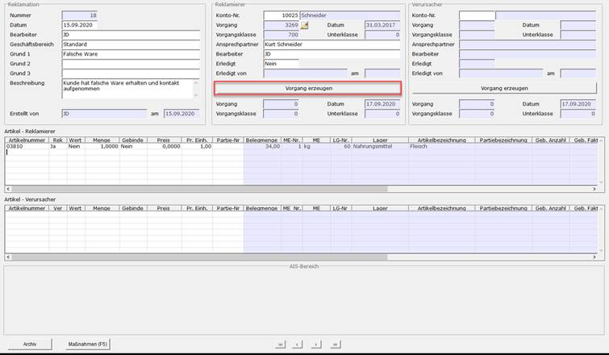
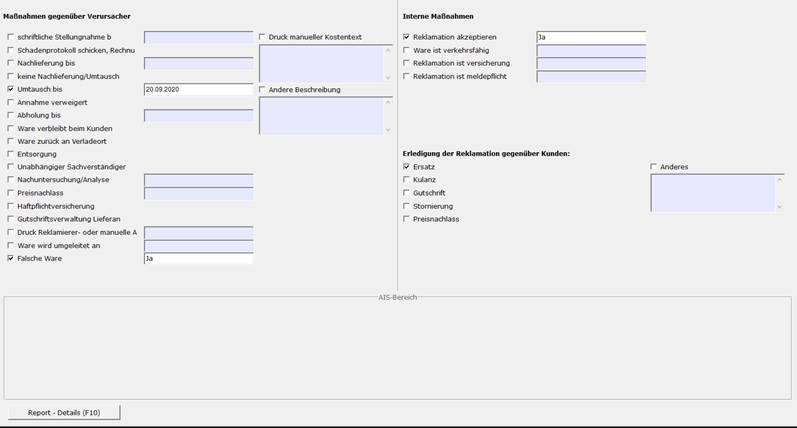

# Schritt 3: Reklamation erstellen

<!-- source: https://amic.de/hilfe/schritt3reklamationerstellen.htm -->

3.1: Vorgang erzeugen

Mit dem Direktsprung [REKLAM] navigiert man in das Reklamationsmodul. Hier kann ein neuer Datensatz mit (F8) erstellt werden.

In der Kaste „Reklamation“ kann das Datum, der Bearbeiter, der Geschäftsbereich des Bearbeiters, die Gründe und die Beschreibung der Reklamation, hinterlegt werden.

Die Kaste Reklamierer ist i.d.R. für den Kunden. Hier werden auch alle relevanten Daten in Bezug auf den Reklamierer hinterlegt. Sowohl die Kunden-Nr. als auch der jeweilige Vorgang in Bezug auf den Kunden müssen hier eingetragen werden. Für die Reklamation ist es außerdem wichtig, dass die Kaste „Artikel-Reklamierer“ mit der Ware (und Menge) gefüllt wird, welche im Vorgang angegeben ist.

Die Kaste Verursacher ist gedacht für z.B. Lieferanten oder andere Verursacher der Reklamation. Die Datenfelder sind die gleichen, wie in der Reklamierer Kaste. Hier müssen in der Kaste „Artikel-Verursacher“ die Artikel eingetragen werden, welche im Vorgang betroffen sind.

Am Ende muss der der Vorgang für die Reklamation erstellt werden. Dafür bietet der Pfleger die Funktion „Vorgang erzeugen“.

3.2: Maßnahmen und Report erstellen

Um die Maßnahmen der Reklamation einzutragen und einen Report dafür zu erstellen, navigiert man im Pfleger mit (F5) in die Maßnahmen. Dort können dann für den Report wichtige Daten eingetragen werden. In diesem Beispiel ist es wichtig das aus dem Report hervorgeht, dass der Kunde eine falsche Ware erhalten hat. Mit (F10) erstellt man den Report. Der erstellte Report wird dann nach dem Druck auch ins Archiv verschoben.

