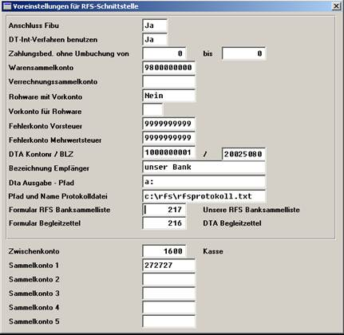

# Einrichtung der Schnittstelle

<!-- source: https://amic.de/hilfe/einrichtungderschnittstelle.htm -->

Die wesentlichen Einrichtungsdaten werden unter dem Direktsprung RFSV ( RFS Voreinstellungen) festgelegt:

