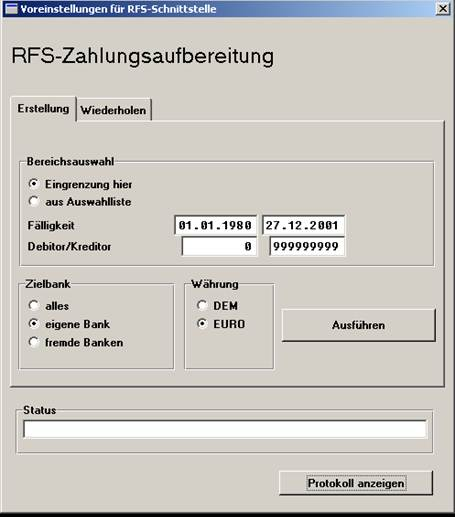

# Erstellung der DTA-Daten

<!-- source: https://amic.de/hilfe/erstellungderdtadaten.htm -->

In der Funktionsauswahl befindet sich schließlich auch die auslösende Funktion für die Erstellung der DTA-Dateien:

Hier wird zunächst einer Unterscheidung zwischen der üblichen Erstellung der Daten und eines eventuellen Wiederholungslaufes getroffen.

Für die Erstellung der Daten werden zwei Varianten der Bereichsauswahl angeboten:
