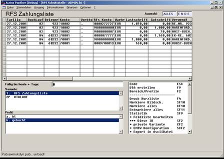
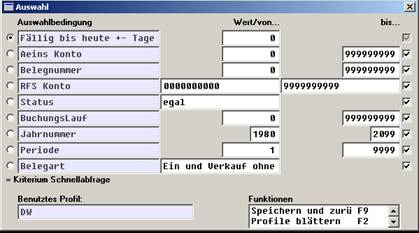

# Kontrolle der aktuell anliegenden Zahlungen

<!-- source: https://amic.de/hilfe/kontrollederaktuellanliegenden.htm -->

Der Direktsprung RFS öffnet eine tabellarische Übersicht aller Daten der RFS Schnittstelle.

Mittels der üblichen Auswahllisten-Mechanik von Aeins bieten sich hier verschiedene Darstellungs- und Auswahlmöglichkeiten:

