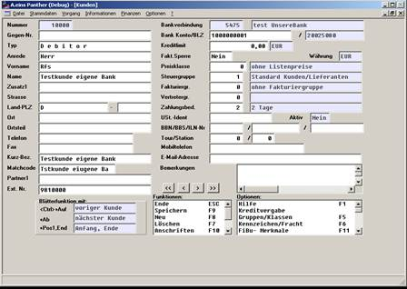

# Kundenspezifischen Einstellungen

<!-- source: https://amic.de/hilfe/kundenspezifischeneinstellunge.htm -->

Die für die RFS-Schnittstelle maßgebliche Kontenzuordnung ( Bisykonto ) wird unter Aeins im Feld „ Ext. Nr.“ hinterlegt ( Feld 3 = Kundennummer unter XCOM !). Weitere wichtige Felder sind:

Die Zahlungsbedingung ( falls der Vorkontenmechanismus benötigt wird)

Die Bankverbindung ( für Bankeinzüge etc )

Die Zahlungsart zur Steuerung , ob Bankeinzug benutzt werden soll ( Funktion FIBU-Merkmale )

