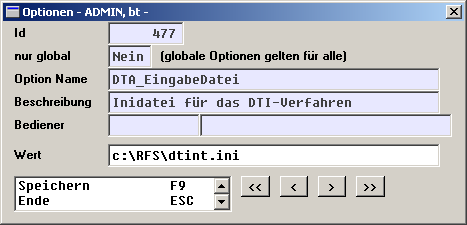

# Parameterdatei für das DTINT-Verfahren

<!-- source: https://amic.de/hilfe/parameterdateifrdasdtintverfah.htm -->

Wenn Sie bei den RFS-Voreinstellungen den Schalter ‚DT-Int Verfahren benutzen‘ auf ‚Ja‘ gestellt haben, benötigt Aeins eine zusätzliche Parameterdatei zum Einstellen verfahrensspezifischer Merkmale.

Das DT-Iint Verfahren ist ein hausinternes Spezialverfahren. Es bietet beim DTA-Austausch erweiterte Möglichkeiten zur Steuerung der Valuta. Es ist jedoch nur auf bankinterne Konten begrenzt. Bei der Erzeugung der DTA Datenträger können keine bankfremden Bewegungen ( Lastschriften / Bankeinzüge ) außerhalb der hauseigenen Bank berücksichtigt werden.

Legen Sie mit Notepad eine Datei ( z.B. DTINT.INI ) nach folgendem Muster an:

//4-stellige Institutsnummer

INSTITUT=9988

//4-stelliger Interner Textschlüssel

INTERNER_TEXT=1234

//6-stellige Primanota-Nummer (900990 bis 900999)

PN_NUMMER=900999

Für ein ordnungsgemäßes Funktionieren des DT-Int-Verfahrens sind die Angaben zu Institut, der internen Textnummer und der Primanotanummer unbedingt erforderlich. Bitte erfragen Sie diese Werte in der EDV-Abteilung Ihrer Bank!

Anschließend tragen Sie unter Optionen ( Direktsprung OPT ) den Pfad und Dateinamen unter folgender Option ein der Pfad steht hier als Beispiel, es wird ein gültiges Verzeichnis auf der Festplatte angenommen !):

