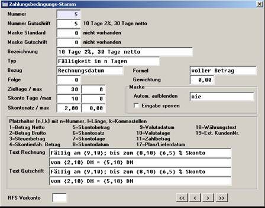

# Vorkonten

<!-- source: https://amic.de/hilfe/vorkonten.htm -->

Da RFS-Vorkonten an die Zahlungsbedingungen gekoppelt sind, werden diese im Aeins auch mit dem Pflegemodul für Zahlungsbedingungen eingerichtet ( Direktsprung ZB ):

