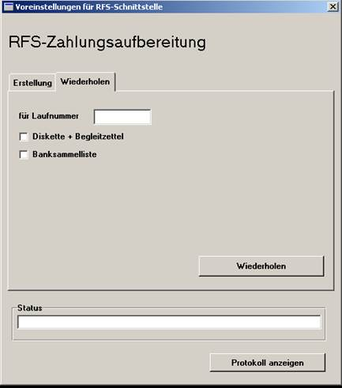

# Wiederholen

<!-- source: https://amic.de/hilfe/wiederholen.htm -->

Es besteht die Möglichkeit, einen DTA-Datensatz nachträglich zu erzeugen:

Zur Auswahl stehen:

Die Erstellung der Daten und der Begleitzettel

die Banksammelliste

In dem Feld ‚LaufNummer’ gibt man die Laufnummer an ( Auswahl per F3 möglich !), die sowohl in der Auswahlliste als auch auf der Banksammelliste ausgewiesen wird.
