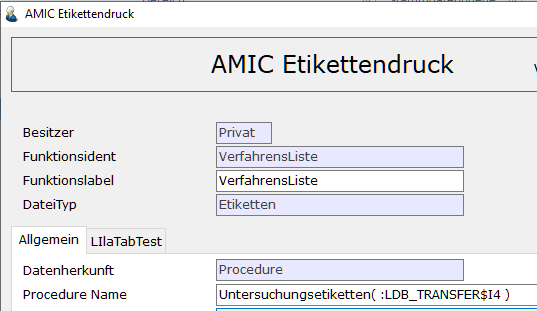
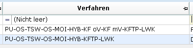

# Laborverfahren

<!-- source: https://amic.de/hilfe/_laborverfahren.htm -->

Hauptmenü > Saatzucht > Saatenlabor > Verfahren

oder Direktsprung **[LABVE]**

In diesem Stammdatenpfleger werden die Daten über Laborverfahren gepflegt. Der Einrichterparameter „[Erweiterte Einstellungen](../../firmenstamm/einrichterparameter/laborverfahren_epa_laborverfahren.md)“ erlaubt weitere Eingabemöglichkeiten auf der Maske.

### Erfassungsmaske

Es stehen folgende Eingabefelder und Eingabemöglichkeiten zur Verfügung.

| Name | Bedeutung |
| --- | --- |
| Verfahrensnummer | Eindeutige Nummer des Laborverfahrens.  |
| Detailprüfung | Art des Verfahrens. Eine Auswahl der möglichen Verfahren ist mit F3 möglich. Bei Eingabe des Verfahrens wird die Karteikarte (Registerkarte des Pflegers für Labordaten) gleich korrekt vorbelegt.  |
| Bezeichnung | Bezeichnung des Verfahrens. Dies wird als Überschrift der Box auf dem Pfleger der Labordaten verwendet.  |

#### Felder auf der Registerkarte Allgemein

| Name | Erweitere Einstellung | Bedeutung |
| --- | --- | --- |
| Druckoptionen | Ja | Hier werden Etikettennamen, die über den [AMIC-Etikettendruck](../amic_etikettendruck/index.md#Amic_Etikettendruck) definiert werden müssen, und die Anzahl der Kopien eingetragen, die für dieses Verfahren gedruckt werden sollen. Der Druck dieser Etiketten geschieht in der Anwendung Labor über die Funktion „Drucke Untersuchungsetiketten“. Im A.eins-System existieren keine Standardvorlagen für die Etiketten. Diese müssen vor Ort entwickelt werden. Um die Daten zu identifizieren wird die aktuelle Qualitaetsid vor dem Aufrufen des jeweiligen Etikettes der Variable „LDB_TRANSFER$I4“ zugewiesen. LDB_TRANSFER$N0 wird die Nummer des Verfahrens zugewiesen. Diese Variable kann dann beim AMIC Etikettendruck verwendet werden. Beispiel(siehe Prozedur Name):     Die Prüfberichte werden in der Tabelle „Verfahrenetiketten“ gespeichert.  |
| Verfahrens Prozedur | Nein | Hier kann der Name einer zu hinterlegenden Prozedur angegeben werden.  |
| Kartenbezeichnung | | Die hier eingegebene Bezeichnung wird der Titel der Registerkarte.  |
| Kurzbezeichnung | | Die Kurze Bezeichnung des Verfahrens wird u.a. in einigen Varianten dazu verwendet, um zu den Labordaten die Verfahren aufzulisten.   |
| Karteikarte | | Es sind die Registerkarten des Pflegers für Labordaten, die bei der Auswahl der Detailprüfung bereits korrekt vorbelegt werden.  |
| Bemerkung | Ja | Hier wird eine Bemerkung für das Verfahren eingetragen.  |
| Druck | | Der Druckstatus wird über das Anwenderformat „af_kfdruck“ bestimmt.  |
| Firma | Ja | Die Firma kann mit F3 ausgewählt werden.  |
| Waageterminal | | Ermöglicht die Zuordnung einer [Waage](../../waagenanbindung/waagenterminals/maske_waagenprofil/index.md) zu den Verfahren „Reinheit“ und „Besatz“. Bei anderen Verfahren wird dieses Feld ausgeblendet.  |

#### Felder auf der Registerkarte „Felder“

| Name | Bedeutung |
| --- | --- |
| Benutzte Felder | Hier werden die Felder angezeigt, die in den Labordaten verwendet werden sollen. Mithilfe der Pfeiltasten auf der Maske können sie zu den „vorhandenen“ Feldern verschoben werden.  |
| Startfeld | Wird zurzeit nicht verwendet.  |
| Restfeld Behandlung | Hier kann angegeben werden, was mit den nicht benutzen Feldern in der Spalte „Vorhandenen Felder“ geschehen soll. <ul><li>egal&nbsp;&nbsp;&nbsp;&nbsp;&nbsp;&nbsp;&nbsp;&nbsp;&nbsp;&nbsp;&nbsp;&nbsp;&nbsp;&nbsp;&nbsp;&nbsp; Es werden nach wie vor alle Felder angezeigt und sind auch änderbar.</li><li>schützen &nbsp;&nbsp;&nbsp;&nbsp;&nbsp;&nbsp;&nbsp; Die Felder werden angezeigt, können jedoch nicht geändert werden.</li><li>verstecken&nbsp;&nbsp;&nbsp;&nbsp;&nbsp; Die Felder werden ausgeblendet. &nbsp;</li></ul> |
| Vorhandende Felder | Hier wird eine Auswahl an Feldern angezeigt, die in den Labordaten für das betreffende Verfahren verwendet werden können. Sollen die Felder in den Labordaten verwendet werden, können sie mithilfe der Pfeiltasten zu dem Feld „Benutzte Felder“ verschoben werden.   |

#### Felder auf der Registerkarte Keimfähigkeit

Das Register **Keimfähigkeit** wird für die Detailprüfungen „Keimfähigkeit“, „Keimfähigkeit gebeizt“, „Keimfähigkeit ungebeizt“, „Triebkraft gebeizt“, „Triebkraft ungebeizt“, „Lufa“, „HLG“ und „Feuchte“ eingeblendet.

| Name | Bedeutung |
| --- | --- |
| Behandlung und Menge | Die Behandlung wird über das Anwenderformat „AF_BEHANDLUN“ erfasst. Im folgenden Feld wird die Menge zur Behandlung eingetragen. Eine Auswahl ist mit F3 über das Anwenderformat „AF_BEHAMENGE“ möglich.  |
| Medium | Medium wird über das Anwenderformat „AF_MEDIUM“ gesteuert.  |
| Körner | Hier werden die Anzahl der Körner und die Anzahl der Wiederholungen eingetragen. Steht der Einrichterparameter „Erweiterte Einstellungen“ auf „Nein“, so können die Anzahl an Körner mittels Anwenderformat „AF_Koerner“ vorbelegt werden.  |
| Vorkühlung | Dauer der Vorkühlung in Tagen.  |
| Temperatur | Temperatur der Vorkühlung.  |
| Keimtage | Hier werden die Keimtage eingetragen. Vorbelegung über Anwenderformat „AF_KEIMTAGE“.  |
| Temperatur | Hier wird die Keimtemperatur eingetragen. Vorbelegung über Anwenderformat „AF_KEIMTEMP“.  |
| Abfragen | Hiermit wird gesteuert, ob die oben vorbelegten Daten im Pfleger der Labordaten noch geändert werden können.  |

### Feuchte Grunddaten

Die Felder zu „Feuchte Grunddaten“ sind nur verfügbar, wenn der Einrichterparameter „Erweiterte Einstellungen“ auf „Ja“ steht.

| Name | Bedeutung |
| --- | --- |
| Schroten | Folgende Ausprägungen sind möglich. <ul><li>Nein</li><li>Grob</li><li>Fein Die Ausprägungen sind im Anwenderformat AF_FESCHROTE hinterlegt und können erweitert werden. &nbsp;</li></ul> |
| Dauer | In dem Feld Dauer wird die Anzahl der Stunden eingetragen. Diese sind in dem Anwenderformat „AF_FEDAUER“ hinterlegt.  |
| Temperatur | In diesem Feld wird die Temperatur eingetragen. Folgende Ausprägungen sind möglich <ul><li>Niedrig (101-105°C)</li><li>Hoch (130-133) Die Daten sind im Anwenderformat „AF_FETEMP“ hinterlegt und können erweitert werden. &nbsp;</li></ul> |

### Hohlmaß Grunddaten

Die Eingabemöglichkeiten für Hohlmaß sind nur verfügbar, wenn der Einrichterparameter „Erweiterte Einstellungen“ auf „Ja“ steht.

| Name | Bedeutung |
| --- | --- |
| Hohlmaß | In diesem Feld kann das Hohlmaß hinterlegt werden. Das Hohlmaß wird im Anwenderformat „AF_LABHOHLM“ gespeichert.  |

### Lufa Grunddaten

Die Eingabemöglichkeiten für Lufa Grunddaten sind nur verfügbar, wenn der Einrichterparameter „Erweiterte Einstellungen“ auf „Ja“ steht

| Name | Bedeutung |
| --- | --- |
| Institut | Hier wird das Auftragslabor aus dem Kundenstamm eingetragen.  |
| Menge | Hier wird die zu untersuchende Masse mit Mengeneinheit eingetragen.  |
| Beschreibung | Hier werden die Inhaltsstoffe der Untersuchung eingetragen wählbar aus den Artikelbestandteile[ABST.]  |
| Vergleich | Größer/Kleiner/-  |
| Standartwert | Hier werden die Standardgrenzwerte der Inhaltsstoffe eingetragen. Vorbelegt aus Artikelbestandteile.  |
| ME | Mengeneinheit der Inhaltsstoffe. Vorbelegt aus Artikelbestandteile. Auswählbar über das Format „AF_LUFAME“  |

### E-Mail Laborleitung

| Name | Bedeutung |
| --- | --- |
| Laborleitung | Hier kann eine Liste von E-Mail Adressen eingetragen werden. Dieses Feld wird im Standard nicht ausgewertet  |
| E-Mail Text | Hier kann ein vorgefertigter Text eingetragen werden. Dieses Feld wird im Standard nicht ausgewertet.  |

#### Felder auf der Registerkarte Vermehrung

Diese Registerkarte wird für die Detailprüfung „Vermehrungen“ eingeblendet.

| Name | Bedeutung |
| --- | --- |
| Prozedur Schläge | Hier wird die Prozedur für „Schläge“ eingetragen.  |
| Prozedur Vermehrer | Hier wird die Prozedur für „Vermehrer“ eingetragen.  |

#### Felder auf der Registerkarte Besatzarten

Die Registerkarte „Besatzarten“ ist nur verfügbar, wenn der Einrichterparameter „Erweiterte Einstellungen“ auf „Ja“ steht und die Detailprüfung auf „Besatz“ oder „Reinheit“ steht.

| Name | Bedeutung |
| --- | --- |
| Untersuchungsmenge | Hier kann dem Verfahren eine Untersuchungsmenge für die Besatzarten zugeordnet werden.  |
| Besatzart | Angabe der Besatzarten, die in dem Verfahren geprüft werden sollen. [Besatzarten](./besatzarten.md) können unter dem Direktsprung [SAATA] gepflegt werden.  |
| Bezeichnung | Bezeichnung der Besatzart.  |
| max. % | Hier kann der Grenzwert für die jeweilige Besatzart in Prozent eingetragen werden. Dieser Grenzwert dient als Vorgabe für die Labordaten.  |
| max. Anzahl | Grenzwert für die Anzahl an Samen für die betreffende Besatzart. Dieser Grenzwert dient als Vorgabe für die Labordaten.  |
| Grp. | Jede Besatzart kann zu einer Besatzartgruppe zugeordnet werden. Es kann zwischen <ul><li>Kultur (Kulturart)</li><li>Unkraut (Wildart) unterschieden werden. Die Vorbelegung erfolgt über das Anwenderformat „AF_BESATZART“. &nbsp;</li></ul> |

#### Felder auf der Registerkarte Merkmale

Die Registerkarte „Merkmale“ wird nur angezeigt, wenn der Einrichterparameter „Erweiterte Einstellungen“ den Wert „Ja“ hat und die Detailprüfung auf „Kontrollanbau“ oder „Markeranalyse“ steht

### Feldversuch

| Name | Bedeutung |
| --- | --- |
| Nummer | Hier können das Labor bzw. das Institut für den Feldversuch aus dem Kundenstamm angegeben werden.  |
| Anschrift | Die Hauptanschrift des Labors bzw. des Instituts.  |
| Menge | Menge für den Feldversuch.  |
| Merkmal | Merkmale für die phänotypische Untersuchung. Mit der Taste **F3** kann eine Auswahl über die [Qualitätsmerkmale](./qualitaetsmerkmale.md) (Direktspring **[SAATR]**)abgerufen werden, die in dem betreffenden Verfahren untersucht werden soll. Hier können nur Qualitätsmerkmale ausgewählt werden, die den Merkmalstyp „Phänotyp“ haben.  |
| Bezeichnung | Bezeichnung des Merkmals.  |

### Markeranalyse

| Name | Bedeutung |
| --- | --- |
| Nummer | Hier kann das Labor bzw. das Institut für die Markeranalyse aus dem Kundenstamm angegeben werden.  |
| Anschrift | Die Hauptanschrift des Labors bzw. des Instituts.  |
| Anzahl | Anzahl an Datenpunkten mit denen das jeweilige Merkmal mit dem entsprechenden Marker untersucht werden soll.  |
| Merkmal | Merkmale für die genotypische Untersuchung. Mit der Taste **F3** kann eine Auswahl über die [Qualitätsmerkmale](./qualitaetsmerkmale.md) (Direktspring **[SAATR]**) abgerufen werden, die in dem betreffenden Verfahren untersucht werden soll. Hier können nur Qualitätsmerkmale ausgewählt werden, die den Merkmalstyp „Genotyp“ haben.  |
| Bezeichnung | Bezeichnung des Merkmals.  |
| Marker | Hier können die Marker angegeben werden, die für die Untersuchung eines Merkmals eingesetzt werden soll. Die Marker werden im Anwenderformat „AF_ANMARKER“ hinterlegt.  |

#### Felder auf der Registerkarte TKM

Die Refisterkarte TKM wird für die Detailprüfungen „TKM“, „TKM Extern“ und „TKM Leguminosen“ eingeblendet.

| Name | Bedeutung |
| --- | --- |
| Kartenbezeich. | Hier kann die Formel für die TKM-Berechnung angegeben werden.  |
| Anzeige TKM g  | Bestimmt, wie der Wert des Feldes „TKM g“ dargestellt wird:   <ul><li>Gerundet:&nbsp;&nbsp;&nbsp;&nbsp;&nbsp;&nbsp;&nbsp;&nbsp;&nbsp;&nbsp;&nbsp;&nbsp;&nbsp;&nbsp;&nbsp;&nbsp;&nbsp;&nbsp; Beispiel: Der Wert 3,6045 wird als 3,605 dargestellt.</li><li>Abgeschnitten&nbsp;&nbsp;&nbsp;&nbsp;&nbsp;&nbsp;&nbsp;&nbsp;&nbsp;&nbsp;&nbsp; Beispiel: Der Wert 3,6045 wird als 3,604 dargestellt. &nbsp;</li></ul> |
