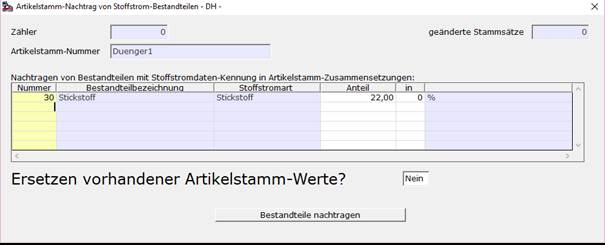

# Artikelstamm-Stoffstromdaten-Anpassung

<!-- source: https://amic.de/hilfe/_ars_stoffstromanpassung.htm -->

Zum schnellen Einfügen von Bestandteilen mit Stoffstrom-Kennung in die Zusammensetzungen mehrerer Artikelstamm-Einträge gibt es eine lizensierte Funktion, die nach Auswahl betroffener Einträge in der Standardauswahllistenvariante des Artikelstamm-Pflegemoduls zur Verfügung steht.

Die gewünschten Bestandteile werden per Angabe der Bestandteilnummer oder F3-Auswahl in der Spalte eingetragen und der jeweilige Anteil nebst des Anteiltyps (0= ‚%‘ oder Mengeneinheitsnummer pro Grundmengeneinheit der zum jeweiligen Artikelstamm gehörenden Mengeneinheitsgruppe) angegeben. Möglich ist hier die Angabe von mehreren Bestandteilen aus der Artikelbestandteil-Liste, die als Stoffstrombestandteil gekennzeichnet sind.  
Sollen für Artikelstamm-Zusammensetzungen, die bereits den einen oder anderen hier angegebenen Bestandteil zugeordnet haben, die dort bereits eingetragenen Werte für Anteil und Anteiltyp geändert werden, so ist im Feld ‚<em>Ersetzen vorhandener Artikelstamm-Werte?‘</em> der Wert **Ja** anzugeben.

Bei Auslösen der Funktion durch Betätigen des Buttons **Bestandteile nachtragen** werden für alle in der Auswahlliste gewählten Artikelstamm-Einträge die Zusammensetzung ergänzt beziehungsweise geändert.
