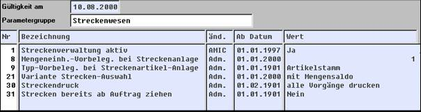
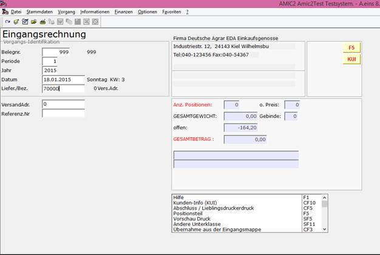
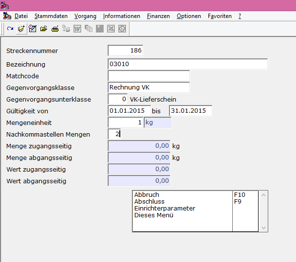
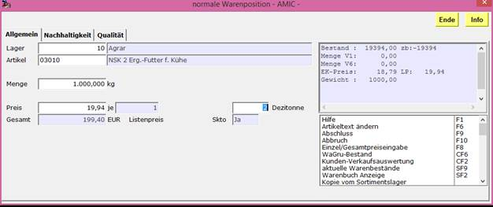
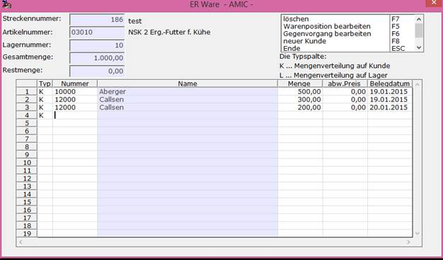
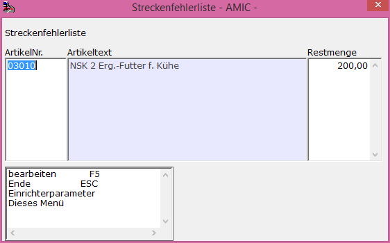
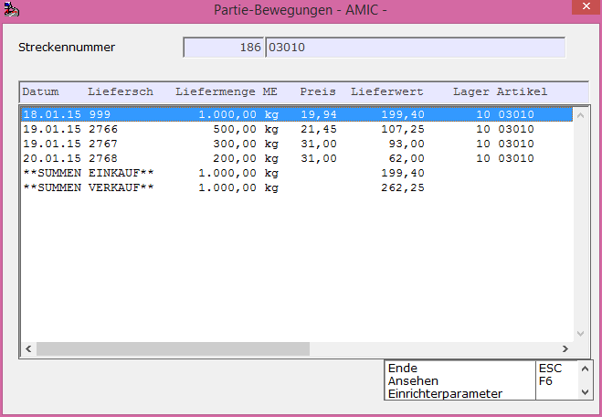
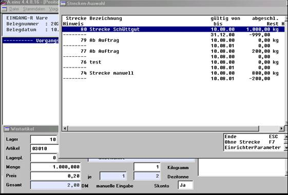
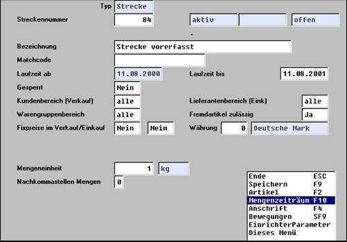
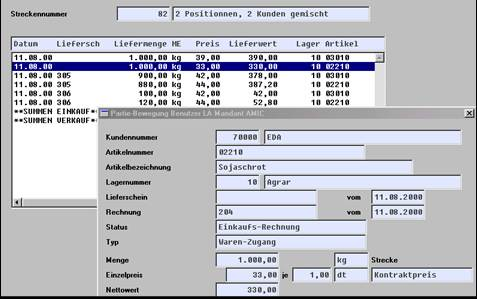

# Allgemeines zur Streckenabwicklung

<!-- source: https://amic.de/hilfe/allgemeineszurstreckenabwicklu.htm -->

Ziel der Streckenabwicklung ist:

Arbeitserleichterung durch Erfassung von Ein- und Verkaufsbeleg in einem Arbeitsgang

Überwachung der Streckengeschäfte auf Erfüllung: Sind zu den Eingangsbelegen die Ausgangsbelege erfasst worden und umgekehrt? Gehen Mengen und Werte auf? Was habe ich an der Strecke verdient?

Streckengeschäfte sollen statistisch vom Lagergeschäft getrennt werden: Geringere Spannen aber auch Kostenbelastungen; kein Lager, etc.

Streckenabwicklung kann bei der Abwicklung unter folgenden Aspekten betrachtet werden:

Es steht ein Eingangsbeleg im Vordergrund, dieser Beleg soll inhaltlich ganz oder teilweise sofort auf einen oder mehrere Ausgangsbelege verteilt werden.  
Der Eingangsbeleg kann auf mehreren Ebenen ( Bestellung, Eingangs­liefer­schein, Eingangsrechnung ) vorliegen.

ein geplantes Streckengeschäft wird erfasst. Hierzu werden die entsprechen­den Belege mit ihrem Anfall schrittweise erfasst.

Systemtechnische Voraussetzungen

In **[MNDNK]** sollten die Nummernkreise für Strecken ( Anlage aus STR ) und automatische Streckenanlage ( Anlage aus Einkaufsvorgang ) eingerichtet werden.

Die Steuerparameter (SPA) im Bereich Strecken / Partien sollten überprüft werden;

Nachfolgende Darstellung zeigt mögliche Einrichtungen:

Nr.1: Mit dem Parameter 1 wird die Streckenverwaltung aktiviert bzw. deaktiviert

Nr. 8: Bei der Neuanlage eines Streckengeschäftes wird es vorbelegt mit dem hier eingetragenen Wert: Wenn Streckengeschäfte z.B. überwiegend im Schüttgutbereich ablaufen und diese z.B. mit der Mengeneinheit kg abgewickelt werden, dann führt die Eingabe der Mengeneinheitsnummer hier zu dieser Vorbelegung. Sie kann natürlich überschrieben werden.

Nr. 9: Eine Streckenanlage kann mit und ohne Lagerzuordnung erfolgen. Eine Zuordnung von Artikelschlüssel und Lager führt später zu einer Prüfung hierauf; wird dagegen Artikelstamm eingetragen, erfolgt kein Lagerprüfung

Nr. 21: Offene Streckengeschäfte werden beim Zuordnen mit unterschiedlichem Informationsgehalt angezeigt. Die dritte Variante zeigt auch den Mengensaldo, sie ist deshalb i.d.R. die empfehlenswerte.

Nr. 30: Je nach Organisationsform werden die Ein- und Ausgangsvorgänge, nur die Urvorgänge oder nichts gedruckt.

Nr. 32: Auf Wunsch können Streckenzuordnungen bereits ab der Stufe Auftrag erfolgen. Dies wird hier eingestellt.

Erfassung von Ein- und Verkauf in einem Vorgang

Bei einer Erfassung auf Basis einer Eingangsrechnung (Direktsprung <strong>[ERES])</strong> oder eines Einganglieferscheines (ELES) mit automatischer Streckeneröffnung wird nicht auf ein bestehendes Streckenkonto Bezug genommen, sondern ein neues Konto automatisch eröffnet.

Die Erfassung beginnt mit dem Eingangsbeleg (ERES oder ELES):

auf **F5** erfolgt automatisch die Streckenneuanlage.

Mit Bezeichnung und Matchcode werden der Strecke 80 weitere Informationen mit­ge­ge­ben. Die Gegenvorgangsklase im Einkauf kann Auftrag/Lieferschein/­Rechnung sein; ggf. kann sogar Bezug auf eine andere Unterklasse genommen werden. Bei Streckengeschäften, die in einem Vorgang komplett abgewickelt werden, kann der Gültikeitszeitraum 1 Tag sein. Wenn die Strecke jedoch schrittweise erfüllt wird und / oder später noch Kostenbelastungen zugeordnet werden sollen, dann muß der Zeitraum länger bestimmt werden. Die Mengeneinheit wird aus den SPA vorbelegt, kann aber überschrieben werden. 

Der erzeugte Streckentyp ist immer Artikelschl./Lager, wobei es sich um das Lager des Quellvorgangs handelt. Bei späterem Zugriff (s. manuelles Buchen) ist das mit anzugeben.

Nach diesen Eingaben werden die Vorgangspositionen des Quellvorgangs mit **F4** erfaßt:

Danach wird automatisch in die Verteilungsmaske Gegenvorgänge gewechselt.

Im Minimalfall wird nur Kunde und Menge des Artikels erfasst; auch eine Verteilung auf mehrere Kunden ist möglich. Dabei kann sowohl ein von der normalen Preisfindung abweichender Preis wie auch das jeweilige Belegdatum angegeben werden.

Mit Eingabe von L in der Spalte Typ wird eine Lagerbuchung ausgelöst: In diesem Fall wurde ein Teil der Ware über Strecke an einen Kunden geliefert und der Rest aufs Lager gebracht. Mit ESC wird die Maske verlassen und die Erzeugung der Gegenvorgänge unter Berücksichtigung der Nebenbuchhaltungen ausgelöst. Es kann aber auch mit **F5** in die Warenpositionsmaske des Gegenvorgangs gesprungen werden. Dies ist z.B. interessant, wenn individuelle Preise o.ä. vergeben werden sollen. Mit F6 gelangt man in die Kopfinformation des Gegenvorgangs, wo ebenfalls Eingabemöglichkeiten bestehen.

Falls das Streckengeschäft unvollständig geblieben ist, wird beim Verlassen des Vorgangs hierauf hingewiesen.

über F5 gelangt man dann wieder in die Streckenverteilmaske.

Mit Beendigung der Erfassung sind die Vorgänge des Ein- und Verkaufs erfasst und in der Streckenverwaltung (STR) verbucht (nach Mandantenserver):

Die erfassten Vorgänge stehen für Weiterverarbeitung zur Verfügung. Änderungen in den streckenrelevanten Positionen führen zu Änderungen auf dem Streckenkonto, jedoch nicht im Gegenvorgang.

Die Erfassung von Quell- und Zielbeleg in einem Vorgang erfolgt immer aus der Sicht des Einkaufs. Bei der Vergabe der Vorgangsstufen ist man jedoch frei: So kann als Eingangsbeleg z.B. ein Eingangslieferschein erfasst werden während der Ausgangsbeleg eine Rechnung ist.

In einem Arbeitsgang können mehrere Artikelpositionen erfasst werden. Sie werden über das eine Streckenkonto abgewickelt. Als Gegenbeleg wird je angesprochenem Kunden ein Beleg mit einer oder mehreren Positionen erzeugt.

Bei einer Belegkopie wird das Streckenkonto mitkopiert; es erfolgt also eine Buchung! 

Manuelles Bebuchen eines Streckenkontos

Wenn zu einem späteren Zeitpunkt z.B. Kostenbelastungen (Frachten, etc.) für das Streckengeschäft vorgenommen werden sollen, können diese manuell belastet werden. Die Eingangsrechnung wird dann unter ERE erfasst und die Position als Wertartikel, da lediglich eine Kostenbelastung erfolgen soll:

Im Positionsteil wird dann mit Shift-STRG-F7 das Streckenfenster geöffnet und die Strecke zugeordnet.

Schrittweise Streckenabwicklung

Eine weitere Vorgehensweise besteht darin , dass zunächst unter **[STR]** eine Strecken­vorbereitung angelegt wird. Der erste Schritt entspricht hier dem oben beschriebenen Vorgehen:

Zusätzlich ist jedoch der (oder die) Streckenartikel anzugeben. Mit F9 steht die Strecke für Buchungen zur Verfügung.

Zu dieser Strecke kann dann aus einem normalen Warenbeleg (Einkauf /Verkauf ) nach obigem Vorgehen gebucht werden:

Erfassen eines Beleges

Erfassen einer Position

Zuordnung innerhalb der Positionserfassung mittels Shift-Strg-F7

Das beschriebene Verfahren kann zum Beispiel dann empfehlenswert sein, wenn nur bekannt ist, dass ein LKW eine Rückladung zu einem Kunden fährt, und es deshalb erst nach­träg­lich dazu entsprechende Belege gibt.

Auswertungen 

Unter STR stehen verschiedene Auswertungen zur Verfügung.

Innerhalb der Auswahlliste können

Die Bewegungen einer ausgewählten Strecke angezeigt werden

Ein- und Ausgangsmenge und –wert mit Saldo dargestellt werden. Hierdurch können sowohl offene Strecken angezeigt als auch der Streckenerfolg analysiert werden.

Der Streckenstamm angezeigt werden

Innerhalb eines Streckenkontos wird ebenfalls (unter Bewegungen) das Streckenkonto angezeigt. Für eine einzelne Bewegung stehen darüber hinaus Detailinformationen zur Verfügung:

Abgrenzung Lager / Streckengeschäft

Wenn Strecken­geschäfte nicht in das normale Lagergeschäft einfließen sollen, so empfiehlt es sich, hierfür Streckenlager einzurichten, über die dann ausschließlich abgewickelt wird.
