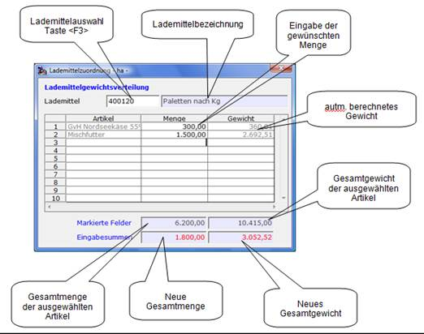

# Maske Lademittelzuordnung

<!-- source: https://amic.de/hilfe/_vorgangsmappe_lademittelzuord.htm -->

Die markierten Mengen aus dem *GFV* werden in diese Maske übernommen. Hier kann das gewünschte Lademittel ausgewählt und die Mengen der einzelnen Positionen verändert werden. Das Gewicht wird aut. berechnet, es können daher Rundungsfehler in Nachkommastellenbereich auftreten. Beim Verlassen der Maske (Taste &lt;ESC>) erscheint eine Abfrage ob gespeichert werden soll. Werden keine Änderungen in der Maske vorgenommen und die Abfrage mit ja bestätigt so werden die im *GFV* ausgewählten Mengen dem Lademittel zugewiesen.
