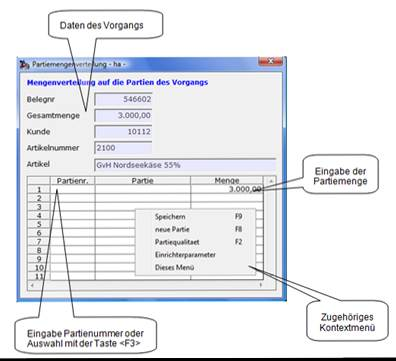

# Maske Partiemengenverteilung

<!-- source: https://amic.de/hilfe/_vorgangsmappe_partiemengenverteil.htm -->

In dieser Maske kann die Gesamtmenge des Artikels auf verschiedene Partien auf gesplittet werden. Dazu wird in der Spalte „Partienr.“ die Partienummer eingegeben oder mittels Taste &lt;F3> eine zugehörige Partie ausgewählt und anschließend kann die Menge verändert werden. Das System erzeugt aut. einen neuen Eintrag mit der noch nicht zugeordneten Restmenge.
