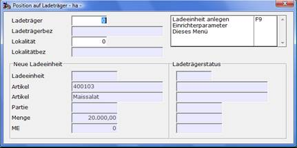

# Maske Position auf Ladeträger

<!-- source: https://amic.de/hilfe/_vorgangsmappe_positionaufLadetraeger.htm -->

Die Maske ermöglicht die Zuordnung von Artikeln zu unterschiedlichen Ladeträgern, die wiederum verschiedenen Lokalitäten zugeordnet werden können.
