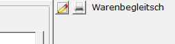
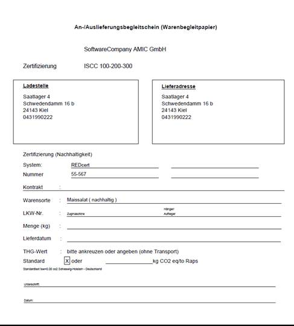

# Streckenerfassung Report Warenbegleitschein

<!-- source: https://amic.de/hilfe/streckenerfassungreportwarenbe.htm -->

### Sprachabhängigkeit

Welche Felder gepflegt werden müssen, um die Sprachabhängigkeit nutzen zu können liest man unter  
[Sprache der Reporte](./sprache_der_reporte.md).

Sprachabhängige Textfelder in diesem Report

| Name Druckfeld | Standard Text im Report |
| --- | --- |
| Ueberschrift_Warenbegleitschein | An-/Auslieferungsbegleitschein (Warenbegleitpapier) |
| Zertifizierung | Zertifizierung |
| ISCC | ISCC |
| Ladestelle | Ladestelle |
| Lieferadresse | Lieferadresse |
| nachhaltig | Zertifizierung (Nachhaltigkeit) |
| System | System: |
| Nummer | Nummer |
| Kontrakt | Kontrakt |
| Warensorte | Warensorte |
| istnachhaltig | (nachhaltig) |
| LKW | LKW-Nr. |
| Termin | Termin |
| Menge3 | Menge (kg) |
| Lieferdatum | Lieferdatum |
| Zugmaschine | Zugmaschine |
| Haenger | Hänger/ |
| Auflieger | Auflieger |
| THG | THG-Wert |
| ankreuzen | bitte ankreuzen oder angeben (ohne Transport) |
| Standard | Standard |
| Standardtext | (Standard - 688 kg CO2 eq/to Raps) |
| oder | oder |
| Einheit | kg CO2 eq/to Raps |
| Unterschrift | Unterschrift: |
| Datum | Datum: |
| Sitz1 | Sitz1 |
| Sitz2 | Sitz2 |
| Sitz3 | Sitz3 (wird ausgeblendet, wenn das Druckfeld nicht gepflegt wird) |
| Sitz4 | Sitz4 (wird ausgeblendet, wenn das Druckfeld nicht gepflegt wird) |
| HR1 | hr1 |
| HR2 | hr2 (wird ausgeblendet, wenn das Druckfeld nicht gepflegt wird) |
| HR3 | hr3 (wird ausgeblendet, wenn das Druckfeld nicht gepflegt wird) |
| HR4 | hr4 (wird ausgeblendet, wenn das Druckfeld nicht gepflegt wird) |

Zusätzlich zum Standardersetzungssystem im Warenbegleitschein kann noch das Druckfeld TextStandardText sowie das Feld TextStandardTextWG genutzt werden.

Von der reportspezifischen Zuordnungsmaske

können dann die Felder THG Text wie auch abweichendes THG im Report genutzt werden.

Als Standardersetzungen werden hierbei die Platzhalter &lt;thg>, &lt;tsw>, &lt;anbauland> und &lt;nutsnummer> ersetzt.

Es gilt die Regel, dass der Standardtext aus TextStandardTextWG genommen wird, wenn kein Warenbegleitschein spezifischer Wert in der Zusatzmaske angegeben ist, ansonsten der Text aus der Zusatzmaske genommen wird.

Die Texte in der Zusatzmaske sind mit einem F3 Auswahlmechanismus versehen, so dass schon einmal eingegebene Texte direkt ausgewählt werden können.

Beispiel für einen Text in der Zusatzmaske wäre dann:

&lt;thg> kg CO2eq/mt Raps in der Region &lt;anbauland> (Nuts=&lt;nutsnummer>).

oder

&lt;thg> g CO2eq/kg Raps (Nuts=&lt;nutsnummer>).

Das System ersetzt vor dem Drucken das Anbauland (hinterlegt im Kunden) und die zugehörige Nutsnummer sowie den auf der Zusatzmaske eingegeben THG Wert.

Wird der Platzhalter &lt;tsw> genutzt, so wird der im System „gefundene“ TSW Wert genutzt.

Ein Beispiel für einen Warenbegleitschein sieht wie folgt aus:

