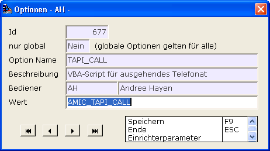
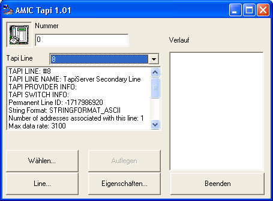
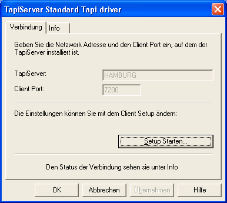
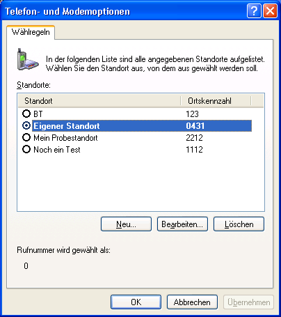
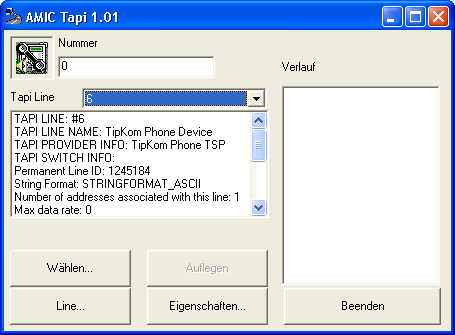
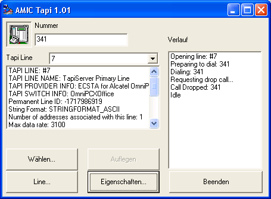

# Ausgehende Telefonie

<!-- source: https://amic.de/hilfe/ausgehendetelefonie.htm -->

Ausgehende Telefonie wurde bisher von A.eins an das Windows-System delegiert und von diesem weiterverarbeitet. Diese Weiterverarbeitung basiert darauf das Windows eine Liste registrierter TAPI-Anwendungen hat und dem Standard-TAPI-Programm die übermittelte Telefonnummer überreicht.

Auf den meisten Windows-Systemen kommt dann der sogenannte Windows-Dialer zum Einsatz und führt den Anruf letztendlich durch.

Die Konfigurierung des Windows-Dialers gestaltet sich ja nach verwendetem Telefonie-Produkt entsprechend, in letzter Zeit stellten sich dabei schier unlösbare Probleme da im Zusammenhang mit Windows 2008 und entsprechenden Umgebungen. Um diese Probleme nicht auf den End-Anwender abzuwälzen und somit zu entschärfen geht A.eins nun eine optionale Strategie. Es setzt mit Hilfe eines extra dafür entwickelten Programmes den Anruf direkt auf der entsprechenden sogenannten Telefonie-Line ab.

Erste Tests in Echtumgebungen ergaben durchweg gute Ergebnisse.

Parametrisiert wird diese Funktionalität über Optionen. Dieses Feature ist bis zur Verwendung und Auswertung A.eins-Versionsabhängig, die eigentliche Telefonie-Applikation ist dann A.eins-Versions-unabhängig und kann somit zeitnah auf etwaige neue Erkenntnisse in dem Telefoniebereich reagieren.

Die Einrichtung erfolgt über Optionen in A.eins.



Hier wird entschieden das bei ausgehenden Anrufen das A.eins-System nicht Windows beauftragt sondert ein internes A.eins-VBA-Script aufruft welches die Weiterverarbeitung übernimmt. Im Standardfalle ist dieses wie oben zu sehen das Script AMIC_TAPI_CALL.

Der Kern des Scriptes sieht so aus:

```text
' --------------------------------------------------------------------
' Zusammenstellen der Aufruf-Parameter
' --------------------------------------------------------------------
dim aufrufparameter
dim linename
dim linename2
dim linenumber
dim automodus
linename = "ProCall"
linename2 = "TapiServer"
linenumber = Aeins.JVARS_Get( 9001 , "JVAR_TAPI_CALL" )
automodus = 1
aufrufparameter = "linename=" & linename &  " " & _
                            "linename2=" & linename2 & " " & _
                            "number=" & linenumber & " " & _
                            "automodus=" & automodus
' --------------------------------------------------------------------
' Veranlassen der Wahl
' --------------------------------------------------------------------
dim tapi_client
dim aeinsverz
aeinsverz = Aeins.param( "exepath" )
tapi_client = aeinsverz & "\amic_tapi.exe" & " " & aufrufparameter
ExecuteDOS tapi_client , 0 , 1
```

Man erkennt dass die Software amic_tapi.exe mit geeigneten Parametern aufgerufen wird.

Standardmäßig unterstütze ich die beiden Lines „Procall“ und „Tapiserver“. Das dürfte auf vielen Systemen schon so ohne weitere Änderung funktionieren und sollte durch einen einfachen Test verifiziert werden.

Bitte beachten Sie dass Sie durch die Technik ein Script zu verwenden sehr flexibel auf eigene Gegebenheiten vor Ort reagieren können. Erstellen Sie sich eine Kopie des Scriptes und passen Sie die Situation auf Ihre Bedürfnisse an. Denken Sie an die Änderung in der Option TAPI_CALL.

Auch im Falle das sich auf Ihren System namentlich andere Lines befinden reagieren Sie bitte wie oben beschrieben. Um den Name der Line zu erfahren können sie amic_tapi_call.exe aus dem A.eins-Bin-Verzeichnis selber verwenden. Ein einfacher Start des Programmes ohne weitere Parameter ergibt z.B. folgendes Bild:



Sie können erkennen dass das System eine „achte“ Tapiline „ausgewählt“ hat und darauf „positioniert“ hat. Der TAPI LINE NAME ist „TapiServer Secondary Line“. Die Funktionen „Wählen“ und „Beenden“ dürften selbsterklärend sein. „Line…“ öffnet den jeweiligen Provider-Dialog der Line, sofern einer vorhanden ist. Bei mir erscheint



Also etwas sehr Hersteller-spezifisches. Bei „Eigenschaften…“ bekommen Sie den Windows-Einrichtungsdialog., z.B.



Merken Sie sich bitte ein signifikantes Teilstück des TAPI LINE NAME. Im Standardscript war es ja „TapiServer“, bei folgender Line



würde ich „TipKom“ empfehlen.

Sie können das Programm verwenden um das System zu testen:



Unter Nummer habe ich „341“ eingeben und dann „Wählen…“, das Gespräch wurde nicht angenommen und dann „Auflegen“. Unter „Verlauf“ sehen sie eine kurze Verlaufschronik.

Ist dieser Test abgeschlossen bzw. war gar nicht notwendig dann steht einer verwendung in A.eins nichts mehr im Wege.

amic_tapi.exe kann per Parameter weiter konfiguriert werden.

| **Parameter** | **Default** | **Beschreibung** |
| --- | --- | --- |
| Linename | ProCall | Vorgabe der zu nehmenden und zu suchenen Line. Es ist nur ein Teilstück der TAPI LINE NAME zu verwenden. |
| Linename2 | Lienname2 | Wie linenname |
| Number | 0 | Die zu wählende Number |
| Automodus | 0 | Siehe nächsten Absatz |

Automodus steuert wie amic_tapi.exe sich erhalten soll. Sicherlich soll das Programm bei A.eins-Verwendung nicht all zu sehr in Erscheinung treten. Und die Wahl automatisch durchführen. Übernimmt keine „Provider“-Software die weitere Verarbeitung, dann fehlt z.B. die Möglichkeit ein Gespräch „aufzulegen“, dann sollte amic_tapi.exe ja aufbleiben …, andernfalls sollte es sich ja schon lange beendet haben.

Die Fälle steuert man nun bequem über „Automodus“ :

| 0 | Amic_tapi.exe verhält sich wie ein ganz normales Programm ☺ |
| --- | --- |
| 1 | Das Programm wählt automatisch die Nummer über die übergebende Line |
| 2 | Das Programm startet stark verkleinert, wählt automatisch die Nummer über die übergebende Line und beendet sich nach Wahl wieder automatisch. Der Anruf wird nicht aufgelegt. |

Beachten Sie dass ich mich im Standard-Script dafür entschieden habe automodus auf 1 zu setzen. Das sollte in den meisten Fällen etwaige Anfangsschwierigkeiten helfen zu mindern. Das man eine spezialisierte Provider-Software auf seinem System hat bemerkt man in aller Regel schnell und die Abschaltung ist ja über die Script-Technik schnell einmalig erledigt.

<p class="siehe-auch">Siehe auch:</p>

- [Ausgehende Telefonie über smx_call 1100](./ausgehende_telefonie_ueber_smx_call_1100.md)
