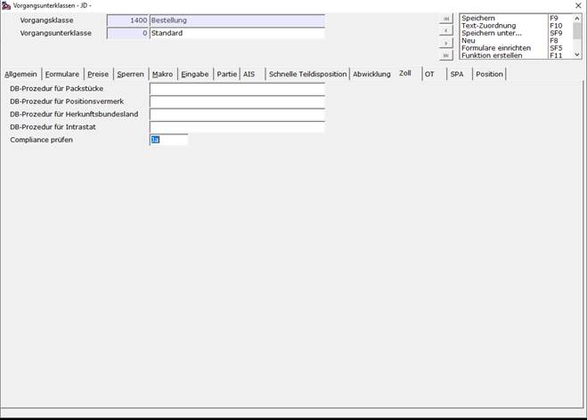
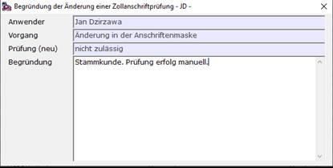

# Schritt 2 Konfiguration

<!-- source: https://amic.de/hilfe/_compliancesfs2.htm -->

Schritt 2.1: Compliance im Vorgang

Mit dem Direktsprung **[FRZ]** gelangt man in die Vorgangsunterklassen bzw. die Formularzuordnung. Hier kann man sich nun einen Vorgang aussuchen, welcher die Compliance Abfrage tätigen soll (dies können auch mehrere Vorgänge sein). Man wählt in der Auswahlliste den gewünschten Vorgang aus und bearbeitet diesen mit **F5** oder ***Bearbeiten***. Als nächstes wechselt man auf das Register *„Zoll“*, und ändert das Feld <em>„Compliance prüfen“</em> mit **F3** auf *„Ja“*. Anschließend speichert man mit **F9** den Datensatz ab.

Schritt 2.2: Compliance manuell ausführen

Um eine Personen/Adressprüfung manuell auszuführen hat man 2 Möglichkeiten:

<strong>1.</strong> Im Kundenstamm: Direktsprung **[KU]**

**2. Im Lieferantenstamm: Direktsprung [LF]**

<strong>3.</strong> Im Anschriftenstamm: Direktsprung **[Ansch]**

**(Das Ergebnis der Prüfung hängt von dem SPA 1063 ab)**

Diese 2 Stammdaten haben in ihrer jeweiligen Auswahlliste die Funktion ***„Verboslistenprüfung“***. Mit einem Rechtsklick auf dem Datensatz befindet sich in der Funktionsliste der Reiter *„Verbotsliste“* und dort die genannte Funktion.

Führt man diese Funktion aus, so wird die Anfrage an den Dienst von AEB manuell ausgeführt.

Die Funktion wird maßgeblich durch die Prozeduren des SPA 1063 beeinflusst. Wenn das Ausführen nicht zum gewünschten Ergebnis führt, muss eine Anpassung an der Prozedur vorgenommen werden.

Schritt 2.3: Ausnahmen hinzufügen

Um Daten der Ausnehmeregelung hinzuzzufügen (GoodGuy), navigiert man in den Anschriftenstamm **[Ansch]**. Dort wählt man den Datensatz aus, welcher als GoodGuy gelten soll und macht einen Rechtsklick. Anschließend, wie in Schritt 2.2, wählt man in der Funktionsliste den Reiter *„Verbotsliste“* aus, um dort die Funktion ***„Als GoodGuy definieren“*** auszuwählen. Danach öffnet sich eine Maske, in der man eine Begründung für diesen Datensatz anlegt.

Am Ende mit **ESC** die Maske verlassen. Gespeichert wird automatisch.

