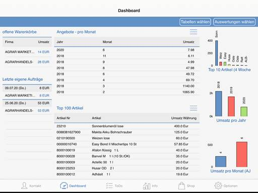

# A.eins App-Dashboard

<!-- source: https://amic.de/hilfe/aeinsappdashboard.htm -->

In diesem Bereich werden die wichtigsten statistischen Informationen angezeigt.

Folgende Auswertungen werden im Standard in Tabellenform mitgeliefert:

\- Letzte Angebote

\- Angebote pro Monat

\- Letzte Aufträge

\- Aufträge pro Monat

\- Letzte Rechnungen

\- Rechnungen pro Monat

\- Karte (Kunden um den aktuellen Standort)

\- Meist verkaufte Artikel

\- Meist verkaufte Artikel aktuelles Jahr

\- Top 100 Kunden

Folgende Auswertungen werden im Standard als Grafik mitgeliefert:

\- Top 10 Kunden (aktuell und Vorjahr)

\- Top 10 Artikel (aktuell und Vorjahr)

\- Umsatz pro Land (aktuell und Vorjahr)

\- Umsatz pro Jahr

\- Umsatz pro Monat (aktuelles Jahr)

\- Umsatz pro Monat (Vorjahr)

