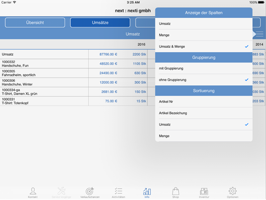

# Umsätze

<!-- source: https://amic.de/hilfe/umstze.htm -->

Die Umsatz Details-Anzeige kann:

\- Sortieren

\- Artikel gruppiert oder flach ohne jede Gruppierung anzeigen

\- Menge und Umsatz gleichzeitig anzeigen.

Außerdem wird eine Summenzeile ausgewiesen.

