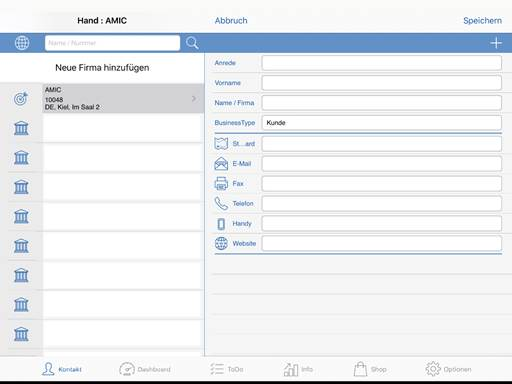
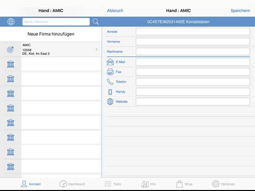

# Funktionen

<!-- source: https://amic.de/hilfe/funktionen6.htm -->

In der App kann man sowohl neue Personen als auch neue Firmen hinzufügen. Zudem haben die Icons der Firmen/Personen-bezogenen Daten Funktionen.

Icon Funktionen

\- Telefon / Handy:  
Ruft die gespeicherte Rufnummer an

\- Webseite:  
Öffnet die gespeicherte Webseite

\- E-Mail:  
Öffnet das standard E-Mail Programm mit der gespeicherten E-Mail als Empfänger

\- Karte:  
Öffnet eine Karte mit dem gespeicherten Standort

Firma hinzufügen

Firmen die in der A.eins App hinzugefügt werden, werden aus Organisationsgründen in der A.eins Software als Interessenten hinzugefügt.

Person hinzufügen

Eine Person wird in der A.eins App als Ansprechpartner in der A.eins Software angelegt.

