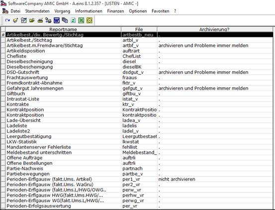

# Inventur in Kurzform

<!-- source: https://amic.de/hilfe/inventurinkurzform.htm -->

Das Wirtschaftsjahr für das neue Jahr muss eingerichtet sein **[JAHR]**:

Direktsprung [JAHR], dann Neu (F8)

Geschäftsjahr = XXXX

Ausführliche Bezeichnung = *„Wirtschaftsjahr XXXX“*

Datum Beginn - Datum Ende

Periodeneinteilung wie Vorjahr = JA

Buchungsjournal Nr. für den Nr.-Kreis oder F3

Kleinstes / größtes Datum = wird bei Datumseingaben in der DB geprüft!

Warndatum Unter- / Überschreit. = 01.01. bzw. 31.12. neues Jahr

F10 / F11 Perioden Fibu / Ware aufrufen und prüfen (Schaltjahr!!)

ESC und Speichern (F9)

Periode 1 in der WAWI des neuen Wirtschaftsjahres muss eröffnet werden [PERER].

Der Inventur-Belegnummern - Zählkreis muss eingerichtet sein **[NKS] [NKZ]**.

Unterschiedliche Inventuren müssen in Gruppen eingeteilt werden **[IVG]**,z.B. Hauptinventur mit JW (1), Zwischeninventuren unterschiedlicher Warengruppen (2).

Über die **Artikelstapelkorrektur** muss die entsprechende Inventurgruppe  
(z.B. 1 = Hauptinventur JW) in die Artikel eingetragen werden.  
    
**Achtung!** Fehlt die Inventurgruppe in den Artikeln bei der Inventurvorbereitung, dann  
 werden keine Artikel eröffnet. Inventurgruppen dürfen nach Inventureröffnung  
 innerhalb eines Inventurjahres nicht geändert werden!

Ein Inventurstamm pro Inventurgruppe muss angelegt werden **[IVS]**.**Bitte beachten:** 

Typ der Inventur: Hauptinventur JW oder Zwischeninventur

Art der Inventur: Stichtag oder Stichtag versetzt

Inventurvorbereitung starten **[IVV]**

Inventureröffnung F5

Zählliste alle Artikel ausdrucken (Vorbelegung beachten!!)

Zählliste Blanko Blankoliste mit Artikel / Menge über alle Artikel

Inventuraufnahme [IVA] (Erfassen der Inventurbestände lt. Zählliste)

mit Bewertungspreis (Voreinstellung lt. Inventurstamm)

automatische Bewertung lt. Bewertungsgruppe im Artikelstamm

folgende Optionen bestehen:

Einzelkorrektur F5

Erfassung F8

Erfassungsprotokoll (Druck)

Mobile Datenerfassung

folgende Prüf - Auswahllisten können aufgerufen werden:

Artikel ohne Inventureröffnung

Bestand ohne Aufnahme

Bewertung [IVP]

einzeln manuell erfassen

Kalkulation

Übernahme

Inventurbestand [IVB]

Variante „1. Zählbestand“ mit den Funktionen:

Einzelbewertung F5 (falls bei der Inventuraufnahme keine Bewertung vorgenommen wurde)

oder

automatische Bewertung F9

ganze Inventur; z.B. 31.12. ...

nur Inventurgruppe ...

nur markierte Artikel

Bemerkung: die autom. Bewertung überschreibt die manuelle Einzelbewertung!

Inventurbestandsliste

Inventurbestand pro EKZ

Variante „2. Differenzen je Lagerort“ mit der Funktion:

Differenzenliste / Diff.-Liste (Druck)

Abschlussarbeiten

Bevor die Inventur abgeschlossen werden kann sind folgende Punkte zu beachten:

Alle Lieferscheine des WJ drucken und umwandeln in Rechnungen!

Alle Rechnungen sowie E-Rechnungen fakturieren und Fibu-Übertrag durchführen!

Alle Rohwarenbelege abrechnen und in die Fibu übertragen!

Alle Belege durch den Mandantenserver verarbeiten lassen!

Alle Vorperioden abschließen!

Buchungsschluss der Inventurperiode!

Alle Vorinventuren müssen eingespielt sein!

Inventurgruppen müssen eröffnet sein!

Inventurerfassung abgeschlossen (alle Artikel mit Bestand am Erhebungstag und alle bewegten Artikel)?

Ist die Bewertung vollständig und abgeschlossen?

Inventurende [IVE] für folgende Abschlussarbeiten:

Inventur prüfen (mögliche Fehlermeldungen):  
Nicht erhobene Artikel mit Bestand:

Entweder entsprechenden Artikelbestand nacherfassen oder Sonderfunktion „Menge 0 für nicht aufgenommene Artikel“ (siehe Seite 36) ausführen, um diese noch nicht erhobenen Artikel mit Bestand zum Stichtag mit Menge 0 in den Inventurbestand einzutragen.

Inventur enthält noch unbewertete Inventuraufnahmen:  
Entweder die Bewertung für die entsprechenden Artikel vervollständigen oder Sonderfunktion „Bewertungskennzeichen setzen“ (siehe Seite 36) ausführen, um die betroffenen Artikel mit 0 zu bewerten.

Abschließen mit Abschlussanalyse:

Die Abschlussanalyse nimmt folgende Prüfungen vor:

1\. alle Inventurgruppen eröffnet?  
2\. Vorperiode abgeschlossen?  
3\. Buchungsschluss Inventurperiode?  
4\. Alle Vor-Inventuren eingespielt?  
5\. Alle Lieferscheine fakturiert?  
6\. Mandantenserver abgeschlossen?  
7\. Alle Warenbelege gebucht?  
8\. Sind alle Fibu-Überträge erfolgt?  
9\. Sind alle Rohwarenabschläge abgerechnet?  
10\. Inventurabgrenzung  
11\. Melden schon abgeschlossener Inventurgruppen  
12\. Bewegte Artikel / Artikel mit Bestand erfasst?  
13\. Lagerplätze mit Bestand erfasst?  
14\. Vollständige Bewertung?  
15\. Buchbestandskennzeichen abhandeln  
16\. Konsistenzprüfung der Artikelbuchungen  
17\. Partien mit Bestand erfasst? (SPA!)  
    

Einspielen

Nur möglich, wenn vorher die Inventur abgeschlossen wurde.

Im Warenbuch wird in der Stichtagsperiode ein Ausbuchungssatz und in der ersten Periode des neuen Jahres ein Einbuchungssatz erzeugt.

Drucken Inventurbestand

Drucken der „Inventurliste nach EKZ“ 

(Hilfsliste für die Einbuchung der Bestandswerte in die Fibu.)

Inventur löschen

(Danach kein Ausdruck der Differenzenliste mehr möglich!)

Die Bestandslisten und das Warenbuch überprüfen!

(Ausbuchung = 31.12. altes Jahr / Einbuchung = 01.01. neues Jahr)

Bestandswerte lt. Inventurliste nach EKZ per Sonderbuchung (SO) in der Fibu erfassen u. 

verbuchen!

Auswertungen und Statistiken drucken und aufbereiten [LST]

