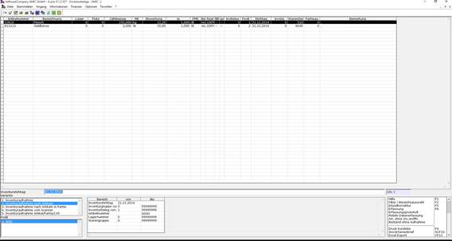
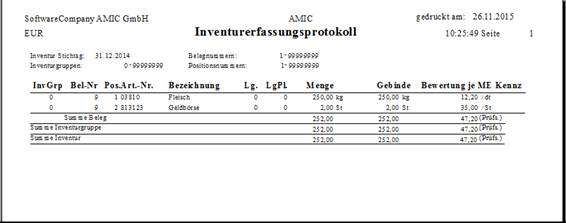

# Inventuraufnahme

<!-- source: https://amic.de/hilfe/inventuraufnahme.htm -->

Hauptmenü > Inventur > Inventuraufnahme

Direktsprung **[IVA]**

Erfassung

Zunächst wird per Stichtag und Inventurgruppe der zugehörige Inventurstamm bestimmt.

Erfassungsrelevante Informationen werden angezeigt. Hier kann auch festgelegt werden, ob der Lagerplatz erfasst werden soll und bei welchem Startfeld ab der 2. Belegzeile begonnen werden soll.

Je nach Einstellungen im Inventurstamm werden Belegnummer und Positionsnummer automatisch erzeugt oder müssen erfasst werden.

Lagernummer, Lagerplatz und Artikelnummer können je Position wechseln.

Vor Eingabe der Menge muss die Erfassungsmengeneinheit angegeben werden, aus der sich dann die weiteren mengenrelevanten Erfassungsfelder ergeben (Gebindefaktoren).

Es werden demnach entweder die Menge oder die Gebindeanzahl und Gebindefaktoren eingegeben.

Die daraus resultierende Menge wird dabei angezeigt.

Zusätzlich kann ein %-Satz im Feld 'Restwert' angegeben werden, der z.B. bei beschädigter Ware zur Bewertung herangezogen wird. Anzugeben ist der Restwert als Prozentsatz. Für eine 40%ige Abwertung wird also ein Restwert von 60 % angegeben.

Außerdem kann angegeben werden, dass die Bewertung zum Buchbestand erfolgen soll, die angegebenen Werte sind dann als Schätzwerte anzusehen. Geprüft wird ob ein so markierter Artikel in einer Zwischeninventur bereits aufgenommen wurde.

Bei entsprechender Einstellung im Inventurstamm, kann der Bewertungspreis mit Preiseinheit und

Preis - Mengeneinheit angegeben werden.

Grundsätzlich können Inventurpositionen nicht gelöscht werden. Es kann jedoch ein Löschkennzeichen gesetzt werden. Die Position ist dann als nicht gültig gekennzeichnet.

Die Eingabe einer Aufnahmemenge 0 und einer Minusmenge ist möglich. Zugelassen wird diese Eingabe aber nur durch Freischaltung eines Steuerparameters **[SPA]** „Nullmenge bei Inventur zulässig“.

Zusätzlich wird ein Kennzeichen für die Art der Inventurbewertung geführt. Es kennzeichnet, ob Bewertungen manuell oder automatisch erfolgt sind. Bei der Inventuraufnahme erfasste Bewertungen gelten als manuell bewertet.

Ist die Aufnahme eines Beleges beendet, kann entweder ein neuer Beleg begonnen werden, eine neue Inventurgruppe und- / oder Stichtag gewählt werden, oder ein bereits zuvor erfasster Beleg zum aktuellen Inventurstamm um weitere Positionen ergänzt werden (siehe Funktionen **F9**, **SF9**, **CF9**, **SF8**).

Die zuletzt erfassten 8 Positionen eines Beleges werden nach Speicherung der Position im oberen Maskenteil zur Kontrolle angezeigt. 

Silo / Ladeträgerzuordnung bei der Inventuraufnahme

Es besteht die Möglichkeit einem Inventurbeleg ein Silo / Ladeträger zuzuordnen. Dazu müssen die Steuerparameter [Lagerverwaltungssystem(SPA 636)](../../firmenstamm/steuerparameter/optionen_global/lagerverwaltungssystem_spa_636.md) und [Anzeige des Silo trotz aktivem SPA 636 bei der Inventuraufnahme](../../firmenstamm/steuerparameter/optionen_warenwirtschaft/anzeige_des_silo_trotz_aktivem_steuerparameter_lagerverwaltu.md) auf „Ja“ gestellt werden.

**Die Erfassung des Silo / Ladeträgers ist nur informativ, bewirkt keine Änderungen an den Silobeständen und wird nicht im Standard ausgewertet**.

Erfassungsprotokoll (F9)

Über den Stand der Erfassung kann ein Erfassungsprotokoll ausgedruckt werden:

Einzelkorrektur

Die in der Auswahlliste markierten Positionen (bzw. alle, wenn keine markiert sind) können im Korrekturmodus bearbeitet werden. Durch Blättern wird dabei von Position zu Position gewechselt.

Auch hier wird nach dem Speichern einer Position deren Information im oberen Maskenteil angezeigt.
