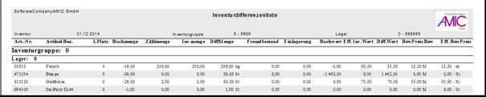
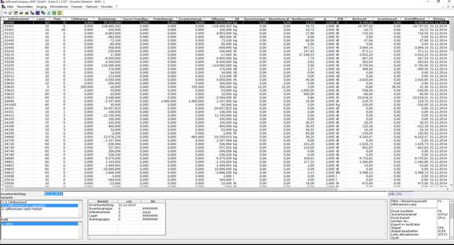
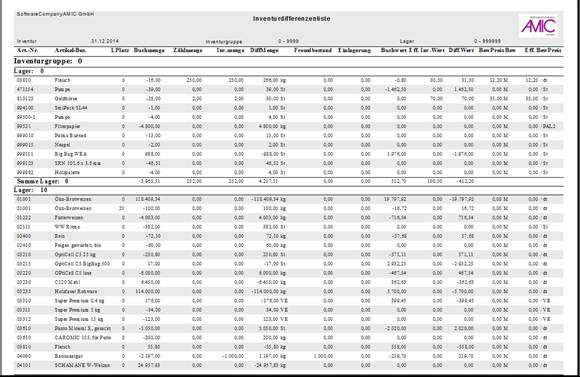

# Inventurbestand

<!-- source: https://amic.de/hilfe/inventurbestand.htm -->

Hauptmenü > Inventur > Inventurbestand

Direktsprung **[IVB]**

Diff.-Liste (Druck)

**Übersicht: Inventurabgrenzung**

Beispiel 1:

Erhebungstag Stichtag 

25.12. 31.12. 

gezählt = 30.000 Buchbestand: 34.000 = Differenz = -4.000

gezählt = 30.000 Zugang: 10.000 Buchbestand: 34.000 = Differenz = 6.000

 Inventurbest: 40.000

Beispiel 2:

Stichtag Erhebungstag

31.12. 10.01.

\= Differenz = -4.000 Buchbestand: 34.000 gezählt = 30.000

\= Differenz = 6.000 Buchbestand: 34.000 Abgang: 10.000 gezählt = 30.000

 Inventurbest: 40.000

Folgende Funktionen der Bewertung sind noch beim Inventurbestand möglich:

Einzelbewertung (Artikelebene) F5

Alle oder einzelne Artikel können mit Hilfe dieser Funktion individuell bewertet werden. Hierzu können die einzelnen Positionen per Stern markiert werden und ein neuer Bewertungspreis eingetragen werden.

Die Funktion „Einzelbewertung“ kennzeichnet Inventurpositionen stets als manuell bewertet. Nur die Funktion automatische Bewertung, mit der Inventurpositionen der Bewertungspreis laut Bewertungsgruppe des Artikels zugewiesen werden kann, kennzeichnet die Inventurpositionen als automatisch bewertet.

Automatische Bewertung F9

Die Bewertung wird auf Grundlage der im Artikel hinterlegten Bewertungsparameter für alle oder den vorher markierten Artikeln automatisch durchgeführt.

***Achtung*:** Die automatische Bewertung überschreibt die manuellen Bewertungen.

Folgende Auswahlmöglichkeiten stehen zur Verfügung:

\- Die automatische Bewertung kann man beziehen:

  - auf die gesamte Inventur (unabhängig vom Auswahlbereich)
  - auf eine ganze Inventurgruppe (entsprechend der ersten markierten Position, unabhängig vom Auswahlbereich)
  - nur auf die markierten Positionen
    - Anwendung:
  - Automatische Bewertung nur auf unbewertete Positionen anwenden
  - Nur auf bereits automatisch bewertete Positionen erneut anwenden
  - Unabhängig von Bewertungsart und Bewertungskennzeichen anwenden

Bedenken Sie, dass je nach Breite der Auswahl die Funktionen langwierig sein können.

Inventurdifferenzenliste

Hier werden die Inventurdifferenzen ermittelt. Der Druck ist zu jedem Zeitpunkt möglich, zwischen Erfassung und Einspielung.

Als CRW-Liste

