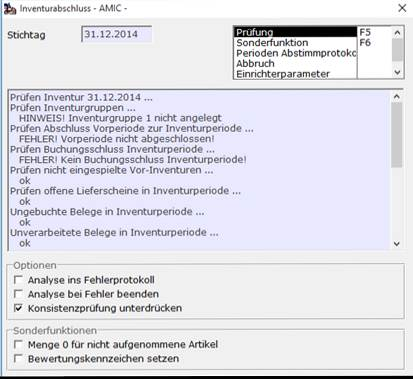
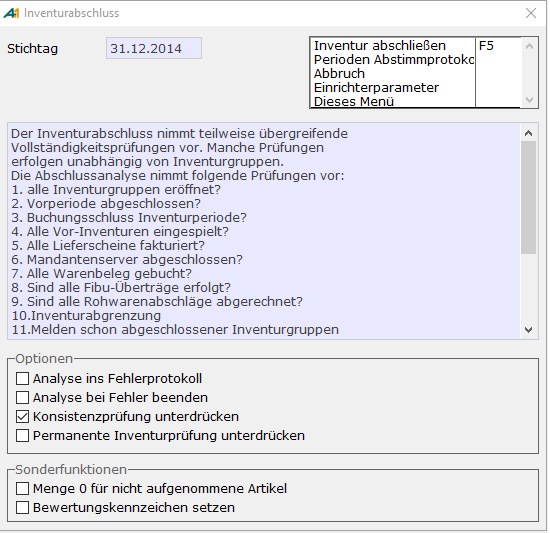
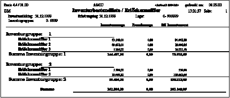
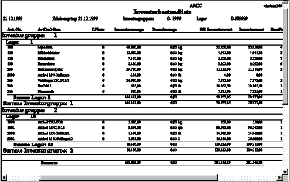

# Inventurende

<!-- source: https://amic.de/hilfe/inventurende.htm -->

Hauptmenü > Inventur > Inventurende

Direktsprung [IVE]

Inventur prüfen F6

Hier wird die Inventur auf Einspielfähigkeit geprüft:

Vortrag permanente Inventur

Wird permanente Inventur verwendet, so muss vor dem Abschluss der Inventur ein Bestandsvortrag gemacht werden. Dies kann aber nur am Ende des oder nach dem Erhebungstag des Inventurstammsatzes erfolgen.

Die Sonderfunktion kann hier ausgeführt werden.

Zur Bedeutung der **Sonderfunktionen**:

Alle Artikel, die zum Inventurstichtag Bestand haben, müssen aufgenommen sein. Nun kann es durchaus sein, dass Artikel bei der körperlichen Aufnahme nicht erhoben wurden, weil sie tatsächlich nicht am Lager sind. Hierzu erfassen Sie entweder eine Aufnahme mit der Menge 0 oder Sie wenden die Sonderfunktion an, mit der Sie für derartige Artikel einen **Inventurbestand 0** zuordnen (ohne einen konkreten Beleg dafür zu erzeugen). Die Wirkung ist in beiden Fällen dieselbe: Sie erreichen bei der Einspielung eine Ausbuchung des Bestandes.

Alle Aufnahmen müssen bewertet sein. Insbesondere durch den Inventurvortrag oder durch obige Funktion erzeugte Inventurbestände können als nicht bewertet gelten. Mit der entsprechenden Sonderfunktion definieren Sie alle **Aufnahmen als bewertet**.

Inventur abschließen F5

Mit dem Inventurabschluss ist eine umfassende Prüfung verbunden:

Sind die Punkte 1 – 9 nicht erfüllt, kann der Abschluss nicht durchgeführt werden!

Bei den Punkten 10 – 14 erfolgt nur ein Warnhinweis!

Folgende Varianten sollten zur Kontrolle aufgerufen werden:

**Bewegte Artikel ohne Aufnahme**

**Artikel mit Bestand ohne Aufnahme**

Mit der Funktion Inventur abschließen F5 wird die Inventuraufnahme abgeschlossen. Weitere Erfassungen oder Änderungen sind nicht mehr möglich!

Bitte wählen Sie die Option „Permanente Inventurprüfung unterdrücken“ nur aus, wenn Sie sicher sind, dass an der Inventur keine Artikel mit permanenter Inventur beteiligt sind. Das wird in der Regel nur der Fall sein, wenn alte Inventuren abgeschlossen werden müssen, die Artikel enthalten, die inzwischen der permanenten Inventur unterliegen.

Einspielen

Das Inventurergebnis wird auf das Artikelkonto (Warenbuch Periode 01 neues Jahr bzw. in die nächstfolgende Periode) eingespielt. Hiermit ist die Inventur endgültig abgeschlossen.

Inventurbestand und Inv.Best.EKZ

Hier können die Inventurwerte wahlweise nach Artikelnummern oder verdichtet nach Erlöskonten ermittelt und gedruckt werden. Diese Listen dienen dann als Buchungsunterlage für die Fibu.

Bemerkung: kann nur nach Einspielung gestartet werden

Anmerkungen zum Inventurabschluss:

Die Auswahllisten zum Bereich Inventurabschluss können bei “breit“ angelegten Selektionsbereichen lange Antwortzeiten bewirken. Daher werden diese Auswahllisten so geschaltet, dass sie zunächst immer die Angabe des Auswahlbereiches verlangen.

Die Vollständigkeitsprüfungen werden wie bisher durchgeführt. Die Prüfung kann separat zur Vorbereitung des Inventurabschlusses durchgeführt werden. Der Abschluss beinhaltet stets einen kompletten Prüflauf.

Vorläufig einspielen / Vorl. Einsp. entfernen

Die Durchführung dieser Funktion ist optional und nur **vor** dem Inventurabschluss möglich. Es ist **kein** endgültiger Periodenabschluss erforderlich.

Es wird eine vorläufige Inventurbuchung erzeugt, die sich auf Aufnahmemengen und Angaben von Bewertungspreisen im Inventurbeleg stützt. Unbewerteten Positionen wird der momentan gültige Bewertungspreis laut Bewertungsgruppe des Artikels zugeordnet und in den Inventurbeleg eingetragen. Nicht erhobene Artikel, die aber einen Buchbestand ausweisen, werden mit der Aufnahmemenge 0 in die Inventur eingetragen.

Es empfiehlt sich, die betreffenden Funktionen bereits vor der vorläufigen Einspielung separat auszuführen: „Aufnahmemenge 0 für nicht erhobene Artikel mit Bestand“ (IVE, Inventurprüfung) sowie „Automatische Bewertung“ (in Anwendung Inventurbestand: IVB).

Weiterhin ist anzuraten, die Inventur abzustimmen, um allzu starke Ausreißer in der Bewertung auszuschließen. Hierfür benutze man die Prüfmethoden für den Inventurabschluss. Nach diesen Maßnahmen verfügt man über plausible Differenzenlisten und eine plausible Inventurliste.

Die vorläufige Einspielung nimmt die gleichen Prüfungen vor, die einer endgültigen Einspielung vorgeschaltet sind. Jedoch werden alle Diagnosemeldungen als Warnungen behandelt, welche die vorläufige Einspielung nicht verhindern.

Optional kann die vorläufige Inventureinspielung ohne eine automatische Konsistenzprüfung der Artikelbuchungen durchgeführt werden (durch Markieren der entsprechenden Option im eingeblendeten Fenster). Man beachte, dass dann die Bedingungen für WAREO vorliegen müssen (Einbenutzerbetrieb, Mandantenserver arbeitet nicht, Mandantenserver hat alle Buchungsaufträge abgearbeitet, Remote Message Agent arbeitet nicht). Alternativ kann zeitlich nah die WAREO-Funktion "Bestandsreorganisation" zur Konsistenzprüfung separat durchgeführt werden.

In allen Auswertungen werden vorläufige Inventureinspielungen analog endgültigen behandelt.

In der Folgezeit stellt man die tatsächlichen Bewertungen zusammen. Hierfür benutzt man in bekannter Weise die Anwendung "Bewertungspreise". Alternativ kann man auch direkt auf dem Inventurbestand arbeiten, hat jedoch den Nachteil, dass man dann tatsächliche Bewertung und vorläufige Bewertung nicht gegenüberstellen kann. Nach Fertigstellung der Bewertung über "Bewertungspreise" wird diese in die Inventur übernommen.

Bevor die Inventur abgeschlossen wird, **muss** die vorläufige Einspielung entfernt werden.  
Die beiden dafür in der Optionbox enthaltenen Funktionen ‚Vorläufige Einspielung entfernen‘ und ‚Ohne Reorganisation vorläufige Einspielung entfernen‘ unterscheiden sich darin, dass erstere automatisch eine Konsistenzprüfung der Artikelbuchungen auslöst, die zweite Funktion dieses zunächst unterlässt, wodurch zu einem späteren Zeitpunkt zwingend eine Reorganisation per WAREO erforderlich ist. Es ist zu beachten, dass für die Ausführung dieser Funktionen die Bedingungen für WAREO vorliegen müssen (Einbenutzerbetrieb, Mandantenserver arbeitet nicht, Mandantenserver hat alle Buchungsaufträge abgearbeitet, Remote Message Agent arbeitet nicht).

Danach können die üblichen Inventurmechanismen wie Abschluss, Inventurlisten erstellen und Inventureinspielung erfolgen.

Beispiel:

Die körperliche Aufnahme der Mengen ist erfolgt und erfasst. Die Bewertung steht jedoch noch aus. Aber man möchte die Mengenkorrekturen bereits wertstellen, sodass zumindest mengenmäßig mit den richtigen Vorträgen gearbeitet wird. Zur Bewertung wird, wenn nicht anders angegeben, die Buchbewertung zum Zeitpunkt der vorläufigen Einspielung herangezogen.

Löschen

Der letzte Schritt nach der Inventureinspielung und dem Drucken ist das Löschen der Inventur.

Es wird die vollständige Inventur gelöscht. Danach ist kein Druck der Differenzenliste mehr möglich!

Auch ist u.a. möglich, eine Zwischeninventur nur als Kontrollinventur durchzuführen, ohne sie einzuspielen. Daher die Option *“auch nicht eingespielte Inventuren löschen“* oder am Jahresschluss bei der Jahreswechselinventur die Option *“auch unterjährige Zwischeninventuren löschen“* (gilt nur für Jahreswechselinventur).

Die Löschung entfernt auch die Stammsätze. Eine Warnung, falls die Inventur nicht eingespielt wurde. Man sei sich sicher, alle erforderlichen Inventurlisten erstellt zu haben.
