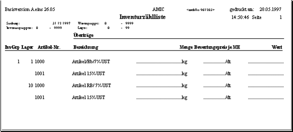

# Inventurvorbereitung

<!-- source: https://amic.de/hilfe/inventurvorbereitung.htm -->

Hauptmenü > Inventur > Inventurvorbereitung

Direktsprung **[IVV]**

Die Inventurvorbereitung besteht aus zwei wesentlichen Punkten.

Inventureröffnung:

Der Eröffnungsvortrag kennzeichnet alle Artikel, die zum Eröffnungszeitpunkt einen Buchbestand und die entsprechende Inventurgruppe haben. Die Inventureröffnung (**F5**) kann aus der Auswahl gestartet werden, wenn der entsprechende Inventur-Stichtag eingegeben wird.

Optional können alle Artikel mit Erhebungsmenge 0 (Null) in den Inventurbestand vorgetragen werden, die zum Zeitpunkt der Inventureröffnung Bestand haben. Auf diese Weise hat man schon während der Inventuraufnahme eine gewisse Kontrolle über die Vollständigkeit der Aufnahmen. Vorläufige Differenzlisten weisen dann auch Inventurdifferenzen für noch nicht aufgenommene Artikel aus. Die endgültige Vollständigkeitskontrolle kann natürlich erst beim Inventurabschluss erfolgen.

Druck der Zähllisten:

Die Zähllisten können ebenfalls aus der Auswahlliste heraus gestartet werden und dienen lediglich zur Unterstützung der Zählung.

Es gibt 3 Arten von Zähllisten:

1. Inventurzählliste vor der Inventureröffnung (über alle Artikel)

2. Inventurzählliste nach der Inventureröffnung (über alle Artikel, die eröffnet wurden)

3. Blankozählliste (ohne Artikel)

